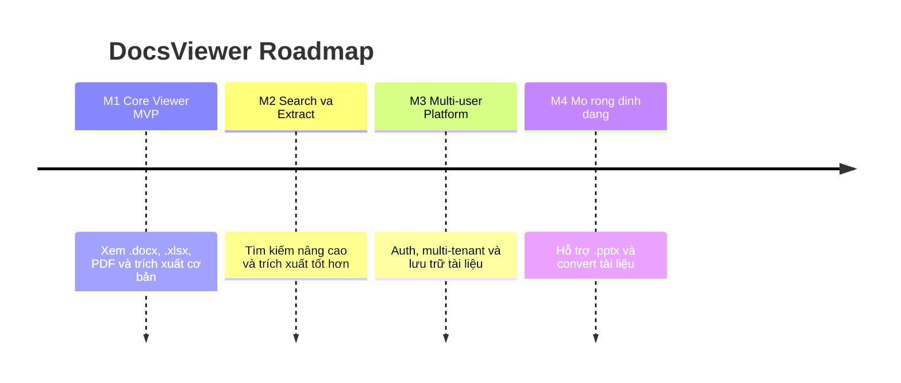

# 🗺️ Product Roadmap — DocsViewer

## Mục lục

1. [Cách đọc Roadmap](#1-cách-đọc-roadmap)
2. [Tổng quan Milestones](#2-tổng-quan-milestones)
3. [Chi tiết từng Milestone](#3-chi-tiết-từng-milestone)
4. [Tài liệu tham khảo](#tài-liệu-tham-khảo)

---

## 1. Cách đọc Roadmap

> [!NOTE]
> Dự án **không có deadline cố định** ⇒ Roadmap tổ chức theo **milestone** (cột mốc giá trị), không gắn ngày tháng cứng. Mỗi milestone hoàn thành khi đạt **Definition of Done (DoD)** của nó, rồi mới chuyển sang milestone kế tiếp.

---

## 2. Tổng quan Milestones

| Milestone | Tên                       | Mục tiêu chính                                          | Trạng thái   |
| :-------- | :------------------------ | :----------------------------------------------------- | :----------- |
| **M1**    | Core Viewer (MVP)         | Xem + trích xuất cơ bản 3 định dạng lõi                | 🟡 Planned   |
| **M2**    | Search & Extract+         | Tìm kiếm nâng cao + nâng chất lượng trích xuất         | ⚪ Future    |
| **M3**    | Multi-user Platform       | Auth, multi-tenancy, lưu trữ & bảo mật tài liệu        | ⚪ Future    |
| **M4**    | Mở rộng định dạng         | `.pptx` + convert tài liệu                              | ⚪ Future    |

---

## 3. Chi tiết từng Milestone

### 🟡 M1 — Core Viewer (MVP)

- **Mục tiêu:** Validate giả thuyết cốt lõi View + Extract trên web.
- **Phạm vi:** Theo [MVP-Scope](./MVP-Scope.md) — xem `.docx`/`.xlsx`/PDF + trích xuất text/data cơ bản + search trong tài liệu + nền tảng kiến trúc multi-user.
- **Definition of Done:**
  - [ ] Mở & xem được cả 3 định dạng trên web.
  - [ ] Trích xuất được nội dung text/data của cả 3 định dạng.
  - [ ] Search được trong nội dung tài liệu đang xem.

### ⚪ M2 — Search & Extract+

- **Mục tiêu:** Nâng chất lượng trích xuất & trải nghiệm tìm kiếm.
- **Phạm vi dự kiến:** Search xuyên nhiều tài liệu, cải thiện độ trung thực render, trích xuất có cấu trúc hơn (bảng, metadata), chuẩn bị đầu ra cho tích hợp AI.

### ⚪ M3 — Multi-user Platform

- **Mục tiêu:** Biến core thành sản phẩm dùng được cho team/khách.
- **Phạm vi dự kiến:** Authentication, multi-tenancy, lưu trữ tài liệu, phân quyền & bảo mật/privacy tài liệu.

### ⚪ M4 — Mở rộng định dạng

- **Mục tiêu:** Tăng độ phủ định dạng & tính năng giá trị cao.
- **Phạm vi dự kiến:** Hỗ trợ `.pptx`, convert tài liệu (Word→PDF, Excel→JSON...).

---

## Tài liệu tham khảo

- [Project Charter — DocsViewer](./Charter-DocsViewer.md)
- [MVP Scope — DocsViewer](./MVP-Scope.md)
- [OKRs](./OKRs.md)
- [Risk Register](./Risk-Register.md)
