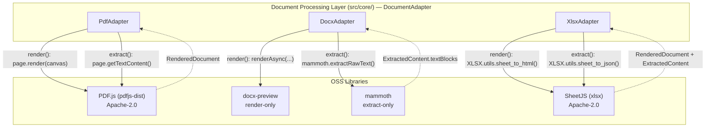
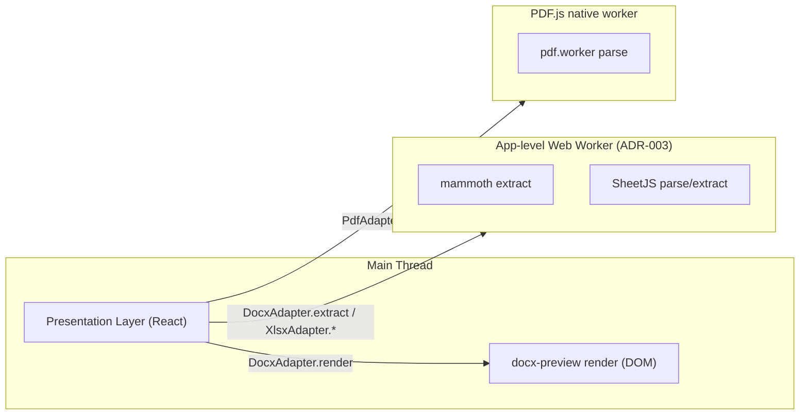
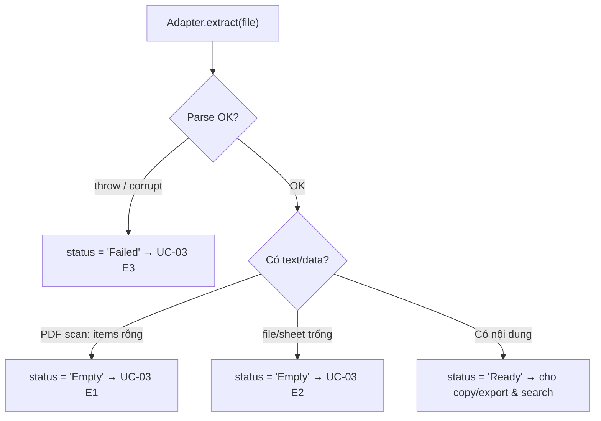

# 📦 Spec — OSS Library Integration (DocsViewer)

> Tài liệu này đặc tả cách DocsViewer tích hợp các thư viện open-source (OSS) để render & extract 3 định dạng lõi (PDF, `.docx`, `.xlsx`). Mục tiêu: khóa rõ **lib nào dùng cho việc gì**, **API cụ thể** (không bịa method), **chiến lược pin version**, **license**, và **degradation per format** — phục vụ quản trị rủi ro phụ thuộc OSS ([R-06](../../010-Planning/Risk-Register.md)) và maintainability ([NFR-09](../../020-Requirements/NFR-DocsViewer.md)).

## Mục lục

1. [Bối cảnh & Phạm vi](#1-bối-cảnh--phạm-vi)
2. [Tổng quan ánh xạ Lib ↔ Adapter (Render vs Extract)](#2-tổng-quan-ánh-xạ-lib--adapter-render-vs-extract)
3. [PDF.js (`pdfjs-dist`)](#3-pdfjs-pdfjs-dist)
4. [docx-preview](#4-docx-preview)
5. [mammoth](#5-mammoth)
6. [SheetJS (`xlsx`)](#6-sheetjs-xlsx)
7. [Web Worker usage](#7-web-worker-usage)
8. [Version-pinning strategy](#8-version-pinning-strategy)
9. [License & Compatibility](#9-license--compatibility)
10. [Maintenance / Community status (R-06)](#10-maintenance--community-status-r-06)
11. [Fallback / Degradation per format](#11-fallback--degradation-per-format)
12. [Traceability](#12-traceability)
13. [Tài liệu tham khảo](#13-tài-liệu-tham-khảo)

---

## 1. Bối cảnh & Phạm vi

DocsViewer là web app **client-side SPA**, xử lý parse/render/extract 100% **trong browser**, không backend ở MVP (M1). Toàn bộ năng lực render fidelity ([NFR-02](../../020-Requirements/NFR-DocsViewer.md)) và extraction accuracy ([NFR-03](../../020-Requirements/NFR-DocsViewer.md)) phụ thuộc vào một nhóm nhỏ thư viện OSS đã chọn ở [ADR-001](../Architecture/ADR-001-Tech-Stack.md). Vì DocsViewer **không tự viết engine parse tài liệu** (KISS/YAGNI — [NFR-09](../../020-Requirements/NFR-DocsViewer.md)), các lib này là điểm phụ thuộc trọng yếu cần được đặc tả & quản trị tường minh — đây chính là nội dung giảm thiểu cho [R-06](../../010-Planning/Risk-Register.md) (phụ thuộc OSS: bug, bỏ maintain, license).

**Trong scope tài liệu này:** 4 thư viện — **PDF.js** (`pdfjs-dist`), **docx-preview**, **mammoth**, **SheetJS** (`xlsx`). Với mỗi lib: vai trò trong kiến trúc (adapter nào dùng cho render vs extract), API cụ thể được gọi, worker usage, pin version, maintenance/community status, license, và ghi chú degradation.

**Ngoài scope:** OCR cho PDF scan (defer Full Scope theo [UC-03](../../020-Requirements/Use-Cases/UC-03-Extract-Export-Content.md) E1) và structured extraction (defer M2).

> [!IMPORTANT]
> Các API signature dưới đây chỉ liệt kê **surface ổn định, đã được tài liệu hóa** của từng lib mà các Adapter thực sự gọi. Anti-hallucination: không thêm helper "nghe hợp lý" mà chưa verify. Engineer khi implement PHẢI đối chiếu lại với version đã pin (xem [§8](#8-version-pinning-strategy)).

---

## 2. Tổng quan ánh xạ Lib ↔ Adapter (Render vs Extract)

Mỗi Adapter (định nghĩa tại [Spec-Module-Contracts](./Spec-Module-Contracts.md) — interface `DocumentAdapter` với `render()`/`extract()`) ủy quyền (delegate) việc nặng cho lib OSS. Điểm **không hiển nhiên duy nhất**: `DocxAdapter` dùng **hai lib khác nhau** cho hai trách nhiệm — `docx-preview` cho render, `mammoth` cho extract. Đây là lý do `mammoth` tồn tại như một dependency riêng (tách rõ render fidelity vs text extraction sạch — trade-off đã chấp nhận ở [ADR-001](../Architecture/ADR-001-Tech-Stack.md)).

| Adapter | `render()` dùng lib | `extract()` dùng lib | Ghi chú |
| :--- | :--- | :--- | :--- |
| **PdfAdapter** | PDF.js (`page.render`) | PDF.js (`page.getTextContent`) | Một lib cho cả hai. |
| **DocxAdapter** | **docx-preview** (`renderAsync`) | **mammoth** (`extractRawText`) | **Hai lib trong một adapter** — docx-preview không có extraction API. |
| **XlsxAdapter** | SheetJS (`XLSX.utils.sheet_to_html`) | SheetJS (`XLSX.utils.sheet_to_json`) | Một lib cho cả hai. |

> Output của mọi lib được Adapter **chuẩn hóa** về Domain Entity canonical (`RenderedDocument`, `ExtractedContent` — xem [DB-Entity-DocsViewer](../Schema/DB-Entity-DocsViewer.md)). Presentation Layer **không bao giờ** chạm trực tiếp vào kiểu dữ liệu raw của lib — đây là tường ngăn (anti-corruption) bảo vệ Core khi cần thay/nâng cấp lib (giảm thiểu [R-06](../../010-Planning/Risk-Register.md)).

---

## 3. PDF.js (`pdfjs-dist`)

**Vai trò:** Dùng bởi **`PdfAdapter`** cho **cả render lẫn extract** (FR-02, FR-06). Là lib mạnh nhất, native cho browser, phục vụ trực tiếp [R-01](../../010-Planning/Risk-Register.md)/[NFR-02](../../020-Requirements/NFR-DocsViewer.md).

### API cụ thể được dùng

| Mục đích | API | Trả về / Ghi chú |
| :--- | :--- | :--- |
| Cấu hình worker | `GlobalWorkerOptions.workerSrc = <pdf.worker url>` | Bắt buộc trước khi parse (xem [§7](#7-web-worker-usage)). |
| Mở document | `getDocument(src).promise` | Resolve `PDFDocumentProxy`. |
| Đếm trang | `pdfDoc.numPages` | Số trang → map vào `RenderedDocument.pageCount`. |
| Lấy 1 trang | `pdfDoc.getPage(n)` | Resolve `PDFPageProxy` (n bắt đầu từ 1). |
| Viewport render | `page.getViewport({ scale })` | Tính kích thước canvas. |
| **Render canvas** | `page.render({ canvasContext, viewport }).promise` | Vẽ trang lên `<canvas>` — phục vụ FR-02. |
| **Extract text** | `page.getTextContent()` | Resolve `{ items }`; mỗi item có thuộc tính `.str` (chuỗi text của fragment) → ghép thành `ExtractedContent.textBlocks` (FR-06). |

> Tách bạch quan trọng: **render thành công không kéo theo extract có nội dung.** Một PDF scan dạng ảnh vẫn render canvas đẹp, nhưng `getTextContent().items` rỗng/chỉ whitespace ⇒ extract `Empty` (xem [§11](#11-fallback--degradation-per-format)).

### Worker
PDF.js **ship worker riêng** (`pdf.worker`), bắt buộc để parse off-main-thread đạt perf. Đây là worker **native của lib** — phân biệt với app-level Web Worker của kiến trúc (xem [§7](#7-web-worker-usage)).

---

## 4. docx-preview

**Vai trò:** Dùng bởi **`DocxAdapter`** **chỉ cho render** (FR-03). Render `.docx` → cây HTML/CSS có fidelity tốt (giữ heading, bảng, list, hình nhúng) phục vụ [NFR-02](../../020-Requirements/NFR-DocsViewer.md).

### API cụ thể được dùng

| Mục đích | API | Ghi chú |
| :--- | :--- | :--- |
| **Render `.docx`** | `renderAsync(data, bodyContainer, styleContainer?, options?)` | `data` = `ArrayBuffer`/`Blob` của file; render trực tiếp vào DOM container → map vào `RenderedDocument.htmlContainer`. |

> [!WARNING]
> docx-preview **không có extraction API**. Nó chỉ render ra HTML, không cung cấp method bóc text sạch. Đây chính là lý do `DocxAdapter` phải dùng **mammoth** riêng cho `extract()` (xem [§5](#5-mammoth)). Không được cố "bóc text từ DOM do docx-preview dựng" — vi phạm separation render/extract và cho text bẩn (mất NFR-03).

### Security note
HTML do docx-preview dựng đến từ tài liệu **không tin cậy** ⇒ nguy cơ XSS (threat T1). Bắt buộc sanitize (DOMPurify) + render trong container sandbox + CSP — chi tiết tại [Spec-Security-DocsViewer](../Security/Spec-Security-DocsViewer.md).

### Styling note (Tailwind preflight)
HTML do docx-preview dựng (và grid HTML từ SheetJS `sheet_to_html`, [§6](#6-sheetjs-xlsx)) là **content area** mang CSS riêng của lib. Tailwind **preflight** (CSS reset — [ADR-001](../Architecture/ADR-001-Tech-Stack.md)) phải được **cô lập khỏi container render** (vd scope reset qua `@layer`, hoặc loại container content khỏi preflight) để base reset của Tailwind không đè/phá style nội dung tài liệu → giữ render fidelity (NFR-02).

### Worker
docx-preview thao tác trực tiếp DOM nên **chạy trên main thread** (không có worker native và không thể chạy trong Worker vì cần `document`). Đây là ràng buộc cần lưu ý cho NFR-01 với file `.docx` lớn (xem [§7](#7-web-worker-usage)).

---

## 5. mammoth

**Vai trò:** Dùng bởi **`DocxAdapter`** **chỉ cho extract** (FR-06). Bóc raw text sạch từ `.docx` phục vụ [NFR-03](../../020-Requirements/NFR-DocsViewer.md) và đầu vào cho SearchEngine ([NFR-04](../../020-Requirements/NFR-DocsViewer.md)).

### API cụ thể được dùng

| Mục đích | API | Trả về / Ghi chú |
| :--- | :--- | :--- |
| **Extract raw text** | `mammoth.extractRawText({ arrayBuffer })` | Resolve Promise `{ value, messages }`; **text nằm ở `.value`**; `messages` chứa warning parse. In-browser nhận `{ arrayBuffer }` (không phải `{ path }`). → map `.value` thành `ExtractedContent.textBlocks` (FR-06). |

> Lựa chọn `extractRawText` (thay vì `convertToHtml`) là cố ý: extract cần **text thuần** cho search/feed AI, không cần markup — KISS ([NFR-09](../../020-Requirements/NFR-DocsViewer.md)).

### Worker
mammoth là JS thuần (không đụng DOM) ⇒ **có thể chạy trong app-level Web Worker** nếu offload (xem [§7](#7-web-worker-usage)). Không có worker native riêng.

---

## 6. SheetJS (`xlsx`)

**Vai trò:** Dùng bởi **`XlsxAdapter`** cho **cả render lẫn extract** (FR-04, FR-07). Parse workbook, dựng grid hiển thị, và bóc data dạng bảng.

### API cụ thể được dùng

| Mục đích | API | Trả về / Ghi chú |
| :--- | :--- | :--- |
| Parse workbook | `XLSX.read(data, { type })` | Trả `WorkBook`; `data` = `ArrayBuffer` (`type: 'array'`). |
| Liệt kê sheet | `wb.SheetNames` | Mảng tên sheet (phục vụ A2 — chọn sheet ở [UC-03](../../020-Requirements/Use-Cases/UC-03-Extract-Export-Content.md)). |
| Lấy worksheet | `wb.Sheets[name]` | `WorkSheet` theo tên. |
| **Render grid** | `XLSX.utils.sheet_to_html(ws)` | Trả HTML table → map vào `RenderedDocument.sheets[]` (FR-04). |
| **Extract data** | `XLSX.utils.sheet_to_json(ws, { header: 1 })` | Trả mảng-các-mảng (rows×cols) → map `ExtractedContent.tabularData` (FR-07). `header: 1` cho dạng array-of-arrays theo hàng/cột. |

> [!NOTE]
> Trap namespace: các hàm chuyển đổi nằm dưới `XLSX.utils.*` (vd `XLSX.utils.sheet_to_html`, `XLSX.utils.sheet_to_json`), **không** phải hàm top-level. Brief viết tắt "sheet_to_html / sheet_to_json" — khi implement phải dùng đầy đủ namespace.

> Theo [NFR-02](../../020-Requirements/NFR-DocsViewer.md): Excel hiển thị **giá trị** ô (formula hiện kết quả, không re-compute engine ở MVP) — `sheet_to_html`/`sheet_to_json` đọc giá trị đã tính sẵn trong file, phù hợp định nghĩa Acceptable Fidelity.

### Worker
SheetJS là JS thuần ⇒ **chạy trong app-level Web Worker** để off-main-thread (NFR-01, NFR-07). Không có worker native riêng (xem [§7](#7-web-worker-usage)).

---

## 7. Web Worker usage

Cần phân biệt **rõ ràng** hai loại worker — không gộp lẫn:

| Loại | Lib | Bản chất | Vì sao |
| :--- | :--- | :--- | :--- |
| **Worker native của lib** | PDF.js (`pdf.worker`) | Lib tự ship & quản lý qua `GlobalWorkerOptions.workerSrc` | Bắt buộc để PDF.js parse đạt perf; là cơ chế nội tại của lib. |
| **App-level Web Worker** | mammoth, SheetJS | Worker do **kiến trúc DocsViewer** tạo ([ADR-003](../Architecture/ADR-003-Layered-Adapter-Registry.md)) để chạy parse nặng off-main-thread | Phục vụ NFR-01 (≤3s trang đầu) & NFR-07 (memory). |
| **Không offload được** | docx-preview | Phải chạy **main thread** (cần `document` để dựng DOM) | Ràng buộc của lib render-to-DOM — cần lazy/chunk cho file lớn. |

> [!NOTE]
> docx-preview chạy main thread là điểm cần theo dõi cho NFR-01/NFR-07 với `.docx` lớn (sát ngưỡng `MAX_FILE_SIZE` 25MB — xem SDD §Resource Limits). Mitigation: render lazy theo trang/section, không block UI dài.

---

## 8. Version-pinning strategy

Nguyên tắc (giảm thiểu [R-06](../../010-Planning/Risk-Register.md), tuân KISS [NFR-09](../../020-Requirements/NFR-DocsViewer.md)):

1. **Pin major** — dùng caret range (`^x.y.z`) để cho phép nâng minor/patch (vá bug & security T3/T4) nhưng **chặn breaking change** của major mới.
2. **Commit lockfile** (`package-lock.json`/`pnpm-lock.yaml`) để build deterministic — đảm bảo render fidelity reproducible.
3. **Re-test bắt buộc khi bump** — mọi thay đổi version lib render/extract phải re-test trên **bộ tài liệu mẫu của NFR-02** (Sample Document Set) trước khi merge. Đây là cổng bảo vệ R-01/NFR-02 khỏi regression do lib.
4. **Theo dõi advisory** — đăng ký security advisory cho 4 lib; ưu tiên cập nhật PDF.js (threat T3) và các parser zip (T2/T4).
5. **Sourcing note (SheetJS):** SheetJS đã dịch chuyển kênh phân phối về CDN riêng của họ; bản npm `xlsx` có thể chậm hơn bản chính thức. Khi pin, ghi rõ nguồn (registry npm vs CDN chính chủ) để tránh nhầm version — đây là một điểm cần kiểm soát trong mitigation R-06, không over-assert trạng thái hiện tại.

---

## 9. License & Compatibility

| Lib | License (theo Architecture Decision Brief) | Loại |
| :--- | :--- | :--- |
| PDF.js (`pdfjs-dist`) | **Apache-2.0** | Permissive |
| docx-preview | **BSD** | Permissive |
| mammoth | **BSD** | Permissive |
| SheetJS (`xlsx`) | **Apache-2.0** | Permissive |

**Kết luận:** Toàn bộ là **OSI-permissive** (Apache-2.0 / BSD / MIT family) ⇒ **tương thích lẫn nhau** và phù hợp dùng trong sản phẩm — thỏa [NFR-09](../../020-Requirements/NFR-DocsViewer.md) và giảm thiểu khía cạnh license của [R-06](../../010-Planning/Risk-Register.md).

> [!NOTE]
> Claim load-bearing cho R-06/NFR-09 là **"permissive + mutually compatible"**, đúng cho cả Apache-2.0/BSD/MIT. Một số nguồn có thể ghi docx-preview là Apache-2.0 thay vì BSD; chênh lệch này **không ảnh hưởng kết luận** vì mọi giấy phép trong nhóm đều permissive & tương thích. Engineer xác minh lại file `LICENSE` của từng package khi pin version ([§8](#8-version-pinning-strategy)) — anti-hallucination.

---

## 10. Maintenance / Community status (R-06)

Đánh giá để định lượng [R-06](../../010-Planning/Risk-Register.md) (phụ thuộc OSS: bug/bỏ maintain):

| Lib | Maintenance / Community | Mức rủi ro single-point |
| :--- | :--- | :--- |
| **PDF.js** | Bảo trì bởi **Mozilla**, rất active, cộng đồng cực lớn, dùng trong Firefox. | Thấp nhất |
| **mammoth** | Trưởng thành & ổn định, API hẹp & rõ ràng, ít breaking change. | Thấp |
| **SheetJS (`xlsx`)** | Dùng rộng rãi, cộng đồng lớn; lưu ý đã đổi kênh phân phối (xem [§8](#8-version-pinning-strategy)). | Thấp–Trung |
| **docx-preview** | **Maintainer base mỏng nhất** trong 4 lib — cộng đồng nhỏ hơn. | **Cao nhất (điểm OSS rủi ro nhất)** |

> [!IMPORTANT]
> **docx-preview là single-point OSS risk cao nhất.** Mitigation cụ thể: (a) tường ngăn Adapter chuẩn hóa output → có thể thay lib render `.docx` mà không sửa Core ([ADR-003](../Architecture/ADR-003-Layered-Adapter-Registry.md)); (b) extract `.docx` đã tách sang mammoth (lib ổn định hơn) nên dù docx-preview hỏng, năng lực extract/search **không bị kéo theo**; (c) theo dõi sát advisory & sẵn lib render `.docx` thay thế trong roadmap nếu bỏ maintain.

---

## 11. Fallback / Degradation per format

Mọi nhánh suy giảm phải map về `ExtractedContent.status` canonical (`'Pending' | 'Ready' | 'Empty' | 'Failed'` — xem [DB-Entity-DocsViewer](../Schema/DB-Entity-DocsViewer.md)) và về Exception Flow của [UC-03](../../020-Requirements/Use-Cases/UC-03-Extract-Export-Content.md).

| Định dạng | Tình huống | Hành vi lib | Kết quả & status | Trace |
| :--- | :--- | :--- | :--- | :--- |
| **PDF** | Scan/ảnh, không có text layer | `page.render` **vẫn render canvas OK**; `page.getTextContent().items` rỗng/whitespace | Render thành công, **extract** → `status = 'Empty'`; báo User không có text để copy/export. (OCR defer Full Scope) | [UC-03](../../020-Requirements/Use-Cases/UC-03-Extract-Export-Content.md) **E1** |
| **PDF / `.docx` / `.xlsx`** | File rỗng / sheet rỗng / doc trống | Parse OK nhưng không có nội dung text/data | `status = 'Empty'`; báo không có nội dung để copy/export | [UC-03](../../020-Requirements/Use-Cases/UC-03-Extract-Export-Content.md) **E2** |
| **PDF / `.docx` / `.xlsx`** | File hỏng/corrupt | Lib throw khi `getDocument`/`renderAsync`/`extractRawText`/`XLSX.read` | Adapter bắt exception → `status = 'Failed'`; báo lỗi parse, không tạo kết quả | [UC-03](../../020-Requirements/Use-Cases/UC-03-Extract-Export-Content.md) **E3** |
| **PDF** | Render trang lỗi cục bộ | `page.render` reject ở 1 trang | Degrade: hiện trang lỗi placeholder, các trang khác vẫn render (lazy — NFR-01/NFR-07) | [NFR-02](../../020-Requirements/NFR-DocsViewer.md) |

> [!IMPORTANT]
> Phân biệt cốt lõi cho PDF: **render ≠ extract**. PDF scan render đẹp (canvas) nhưng extract `Empty`. Đừng để extract `Empty` bị hiểu nhầm thành render fail.

> Search phụ thuộc chất lượng extraction ([R-02](../../010-Planning/Risk-Register.md), BR-006-3): khi `status` là `Empty`/`Failed`/chưa `Ready`, SearchEngine báo không thể search (UC-04 E3). Suy giảm extraction trực tiếp tác động NFR-03/NFR-04.

---

## 12. Traceability

| Mục | Trace tới |
| :--- | :--- |
| Lựa chọn 4 lib OSS | [ADR-001](../Architecture/ADR-001-Tech-Stack.md) |
| Render fidelity các lib | [NFR-02](../../020-Requirements/NFR-DocsViewer.md) (Acceptable Fidelity) · [R-01](../../010-Planning/Risk-Register.md) |
| Extraction accuracy (mammoth/PDF.js text) | [NFR-03](../../020-Requirements/NFR-DocsViewer.md) · [R-02](../../010-Planning/Risk-Register.md) |
| Pin version · license · maintenance · KISS/OSS | **[NFR-09](../../020-Requirements/NFR-DocsViewer.md)** · **[R-06](../../010-Planning/Risk-Register.md)** |
| Worker off-main-thread | [NFR-01](../../020-Requirements/NFR-DocsViewer.md) · [NFR-07](../../020-Requirements/NFR-DocsViewer.md) · [ADR-003](../Architecture/ADR-003-Layered-Adapter-Registry.md) |
| Adapter tách lib khỏi Core (thay lib không sửa core) | [ADR-003](../Architecture/ADR-003-Layered-Adapter-Registry.md) · KR3.2 |
| Degradation per format (Empty/Failed) | [UC-03](../../020-Requirements/Use-Cases/UC-03-Extract-Export-Content.md) E1/E2/E3 · `ExtractedContent.status` |
| XSS từ docx-preview HTML | [Spec-Security-DocsViewer](../Security/Spec-Security-DocsViewer.md) (T1) |

---

## 13. Tài liệu tham khảo

- [NFR — DocsViewer](../../020-Requirements/NFR-DocsViewer.md)
- [Risk Register — DocsViewer](../../010-Planning/Risk-Register.md)
- [UC-03 — Extract & Export Content](../../020-Requirements/Use-Cases/UC-03-Extract-Export-Content.md)
- [Glossary — DocsViewer](../../999-Resources/Glossary.md)
- [ADR-001 — Tech Stack](../Architecture/ADR-001-Tech-Stack.md)
- [ADR-003 — Layered Adapter Registry](../Architecture/ADR-003-Layered-Adapter-Registry.md)
- [Spec — Module Contracts](./Spec-Module-Contracts.md)
- [DB-Entity — DocsViewer](../Schema/DB-Entity-DocsViewer.md)
- [Spec-Security — DocsViewer](../Security/Spec-Security-DocsViewer.md)

---
*Generated by TNMCORE-OS Architect Role.*
