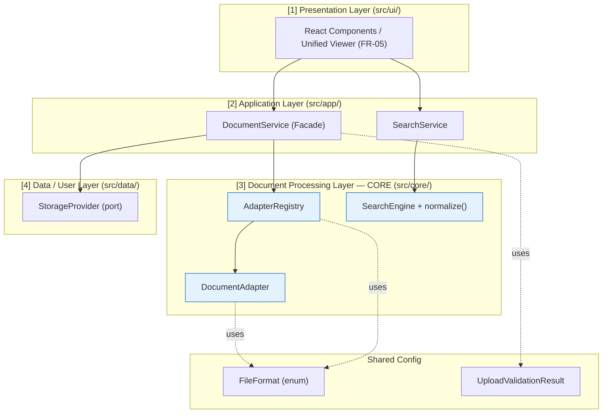

# 📐 Spec — Module Contracts (Internal TypeScript API)

## Mục lục

1. [Bối cảnh & Phạm vi](#1-bối-cảnh--phạm-vi)
2. [Bản đồ Contract → Layer](#2-bản-đồ-contract--layer)
3. [Config Contracts](#3-config-contracts)
   - [3.1. `FileFormat`](#31-fileformat)
   - [3.2. `UploadValidationResult`](#32-uploadvalidationresult)
4. [Core Contracts (Document Processing Layer)](#4-core-contracts-document-processing-layer)
   - [4.1. `DocumentAdapter`](#41-documentadapter)
   - [4.2. `AdapterRegistry`](#42-adapterregistry)
   - [4.3. `SearchEngine` + `normalize`](#43-searchengine--normalize)
5. [Application Contracts](#5-application-contracts)
   - [5.1. `DocumentService` (Facade)](#51-documentservice-facade)
   - [5.2. `SearchService`](#52-searchservice)
6. [Data Contract (Port)](#6-data-contract-port)
   - [6.1. `StorageProvider`](#61-storageprovider)
7. [Contract → Use Case Mapping](#7-contract--use-case-mapping)
8. [Bao phủ Functional Requirements (FR-01..11)](#8-bao-phủ-functional-requirements-fr-0111)
9. [Tài liệu tham khảo](#9-tài-liệu-tham-khảo)

---

> [!NOTE]
> MVP có KHÔNG external HTTP API; đây là contract nội bộ giữa các module. Server API reserved cho M3.

## 1. Bối cảnh & Phạm vi

DocsViewer (M1/MVP) là **client-side SPA**, xử lý parse/render/extract 100% trong browser, không có backend / không có DB (SRS §2.1, §4.3). Vì vậy "API Specs" của Phase-2 **không phải** một REST/HTTP API mà là tập **internal TypeScript module contracts** — các `interface`/`type` định nghĩa "ranh giới hợp đồng" giữa các lớp kiến trúc (Presentation → Application → Core → Data).

Mục tiêu của tài liệu này:

- Là **SSOT** về chữ ký (signature) các module contract để Engineer implement và QA viết test mà không cần đoán.
- Đảm bảo các contract phủ đủ **3 use case chính** (UC-02 upload & view, UC-03 extract & export, UC-04 in-document search) và **FR-01..11**.
- Giữ **Dependency Rule một chiều**: Core không phụ thuộc Presentation/UI hay danh tính người dùng (KR3.1, NFR-05). Thêm định dạng = thêm `DocumentAdapter` (KR3.2); gắn auth/multi-tenant = thay impl `StorageProvider` (KR3.3) — đều **không sửa Core**.

> [!IMPORTANT]
> Các Domain Entity được tham chiếu bên dưới (`DocumentSession`, `RenderedDocument`, `ExtractedContent`, `SearchIndex`, `SearchResultSet`, `SearchMatch`) là **runtime/in-memory data model**, được định nghĩa canonical tại Schema artifact: [`DB-Entity-DocsViewer.md`](../Schema/DB-Entity-DocsViewer.md). Tài liệu này **không** định nghĩa lại chúng — chỉ dùng làm input/output type của các contract.

---

## 2. Bản đồ Contract → Layer

Sơ đồ ánh xạ 8 contract vào kiến trúc layered 4 lớp (SDD §Layered / ADR-003). Mũi tên là chiều phụ thuộc (1 chiều), thể hiện FR-11.1 (tách Core khỏi UI & user) và FR-11.3 (extension point).



---

## 3. Config Contracts

### 3.1. `FileFormat`

```typescript
enum FileFormat { PDF = 'pdf', DOCX = 'docx', XLSX = 'xlsx' }
```

- **Trách nhiệm:** Enum canonical của 3 định dạng lõi MVP (Glossary "Định dạng lõi"). Là khóa định danh dùng xuyên suốt để route adapter (`AdapterRegistry.resolve`), gắn metadata Domain Entity, và tra cứu ngưỡng `MAX_FILE_SIZE`.
- **Input/Output:** Không có hành vi — chỉ là kiểu giá trị. Mọi định dạng ngoài enum này bị từ chối ở tầng validation (FR-01.1).
- **Trace:** FR-01.1, FR-05.2, KR1.1.

### 3.2. `UploadValidationResult`

```typescript
type UploadError = 'UNSUPPORTED_FORMAT' | 'FILE_TOO_LARGE' | 'CORRUPT';
interface UploadValidationResult {
  ok: boolean;
  format?: FileFormat;
  error?: UploadError;
  message?: string;        // thông báo thân thiện (FR-01.3)
}
```

- **Trách nhiệm:** Kết quả của bước validate file trong giai đoạn Upload/Ingestion (Glossary "Ingestion / Upload"). Mã hóa kết quả pass/fail của FR-01 thành một giá trị type-safe để Presentation hiển thị thông báo phù hợp.
- **Input:** Một `File` do user chọn/kéo-thả.
- **Output:** `ok: true` + `format` khi hợp lệ; `ok: false` + `error` + `message` thân thiện khi từ chối.
- **Error cases (ánh xạ UC-02 Exception Flow):**
  - `UNSUPPORTED_FORMAT` → **UC-02 E1** (định dạng ngoài PDF/`.docx`/`.xlsx`); message phải nêu rõ các định dạng được hỗ trợ (FR-01.1).
  - `FILE_TOO_LARGE` → **UC-02 E2**; kích hoạt khi file vượt ngưỡng `MAX_FILE_SIZE` (xem [NFR §4.1](../../020-Requirements/NFR-DocsViewer.md#41-max_file_size--ngưỡng-kích-thước-file-đề-xuất--architect-chốt-ở-phase-2)) — message nêu rõ giới hạn (FR-01.2).
  - `CORRUPT` → **UC-02 E3** (file hỏng/không parse được); hệ thống không crash, hiển thị lỗi thân thiện (FR-01.3).
- **Trace:** FR-01.1, FR-01.2, FR-01.3 · UC-02 (E1/E2/E3) · R-05.

---

## 4. Core Contracts (Document Processing Layer)

> Core là lớp **thuần** — không phụ thuộc UI hay danh tính người dùng (FR-11.1, KR3.1, NFR-05). Phần lớn xử lý nặng (PDF.js/SheetJS) chạy trong Web Worker (NFR-01, NFR-07).

### 4.1. `DocumentAdapter`

```typescript
// CORE — pluggable adapter (FR-11, KR3.2)
interface DocumentAdapter {
  readonly format: FileFormat;
  canHandle(file: File): boolean;                 // extension/MIME (FR-05.2)
  render(file: File): Promise<RenderedDocument>;  // FR-02/03/04
  extract(file: File): Promise<ExtractedContent>; // FR-06/07
}
```

- **Trách nhiệm:** Hợp đồng chung cho mọi định dạng (Adapter Pattern). Mỗi định dạng có một impl riêng — `PdfAdapter`, `DocxAdapter`, `XlsxAdapter` — đóng gói lib OSS tương ứng (xem [Spec-Integration-OSS-Libraries](./Spec-Integration-OSS-Libraries.md)). Đây là **điểm mở rộng cốt lõi** (FR-11.2): thêm `.pptx` ở M4 = viết adapter mới + `registry.register()`, không sửa Core.
- **Inputs/Outputs:**
  - `canHandle(file)` → `boolean`: kiểm tra extension/MIME để Registry chọn đúng adapter (FR-05.2).
  - `render(file)` → `Promise<RenderedDocument>`: dựng nội dung hiển thị theo định dạng (PDF page/zoom — FR-02; `.docx` HTML — FR-03; `.xlsx` grid — FR-04) ở mức Acceptable Fidelity ([NFR-02](../../020-Requirements/NFR-DocsViewer.md#-nfr-02--render-fidelity-độ-trung-thực-render)).
  - `extract(file)` → `Promise<ExtractedContent>`: bóc tách text (PDF/`.docx` — FR-06) hoặc data dạng bảng (`.xlsx` — FR-07), mục tiêu accuracy [NFR-03](../../020-Requirements/NFR-DocsViewer.md#-nfr-03--extraction-accuracy-độ-chính-xác-trích-xuất).
- **Error cases (ánh xạ UC Exception Flow):**
  - `render` thất bại do file hỏng → **UC-02 E3**: Promise reject; Application chuyển `DocumentSession.status` sang `Failed`.
  - `extract` với PDF scan/ảnh (không có text layer) → **UC-03 E1**: trả `ExtractedContent` với `status: 'Empty'` (OCR defer M2).
  - `extract` với file trống → **UC-03 E2**: `status: 'Empty'` (không có nội dung để copy/export).
  - `extract` lỗi parse → **UC-03 E3**: Promise reject hoặc `status: 'Failed'`.
- **Trace:** FR-02, FR-03, FR-04, FR-05.2, FR-06, FR-07, FR-11.2 · UC-02 (A1/A2, E3) · UC-03 (E1/E2/E3) · KR3.2 · R-01, R-02.

### 4.2. `AdapterRegistry`

```typescript
interface AdapterRegistry {
  register(adapter: DocumentAdapter): void;       // thêm format không sửa core (KR3.2)
  resolve(format: FileFormat): DocumentAdapter | undefined;
}
```

- **Trách nhiệm:** Sổ đăng ký (Registry Pattern) ánh xạ `FileFormat` → `DocumentAdapter`. Tách rời việc *biết có những adapter nào* khỏi Core logic, hiện thực hóa FR-11.2/KR3.2 (thêm định dạng = `register()` thêm, không sửa core viewer).
- **Inputs/Outputs:**
  - `register(adapter)` → `void`: đăng ký một adapter (thường gọi lúc bootstrap app).
  - `resolve(format)` → `DocumentAdapter | undefined`: tra cứu adapter cho định dạng đã phát hiện. `undefined` ⇒ định dạng không hỗ trợ.
- **Error cases:** `resolve` trả `undefined` với định dạng không đăng ký → Application phản hồi như **UC-02 E1** (`UNSUPPORTED_FORMAT`). Đây là backstop cho FR-05.2 (báo lỗi nếu định dạng không hỗ trợ).
- **Trace:** FR-05.2, FR-11.2 · UC-02 (E1) · KR3.2.

### 4.3. `SearchEngine` + `normalize`

```typescript
// CORE — search (FR-09/10, BR-006-*)
interface SearchEngine {
  buildIndex(content: ExtractedContent): SearchIndex;
  search(index: SearchIndex, query: string): SearchResultSet; // BR-006-4
  next(rs: SearchResultSet): SearchResultSet;                 // BR-006-5 wrap-around
  prev(rs: SearchResultSet): SearchResultSet;                 // BR-006-5 wrap-around
}
// normalize: NFD + bỏ dấu (strip combining marks U+0300–U+036F) + lowercase + đ→d (BR-006-4: diacritic & case insensitive, substring)
// Lưu ý: đ/Đ (U+0111/U+0110) KHÔNG decompose dưới NFD → cần bước replace đ→d để "da nang" khớp "Đà Nẵng".
function normalize(input: string): string;
```

- **Trách nhiệm:** In-document search trên nội dung đã trích xuất của **tài liệu đang xem** (single-document — BR-006-1). Logic thuần in-memory, không lib (KISS — NFR-09). `normalize` là khối nguyên tử thực thi quy tắc khớp BR-006-4.
- **Inputs/Outputs:**
  - `buildIndex(content)` → `SearchIndex`: xây index từ `ExtractedContent` (phụ thuộc chất lượng extraction — BR-006-3, R-02).
  - `search(index, query)` → `SearchResultSet`: khớp **substring** trên chuỗi đã `normalize` (case-insensitive + diacritic-insensitive — BR-006-4); trả list `SearchMatch`, đếm `total`, highlight (FR-09, FR-10.1; mục tiêu [NFR-04](../../020-Requirements/NFR-DocsViewer.md)).
  - `next` / `prev` → `SearchResultSet`: điều hướng kết quả **wrap-around** (BR-006-5) — cập nhật `activeIndex`, cuối → đầu, đầu → cuối (FR-10.2).
  - `normalize(input)` → `string`: `input.normalize('NFD').replace(/[̀-ͯ]/g, '').toLowerCase().replace(/đ/g, 'd')`. Bước cuối (`đ→d`) xử lý `đ/Đ` vốn **không** decompose dưới NFD. Ví dụ: gõ "bao cao" khớp "Báo Cáo", "da nang" khớp "Đà Nẵng" (BR-006-4).
- **Error cases (ánh xạ UC-04 Exception Flow):**
  - Không có kết quả → **UC-04 E1**: `SearchResultSet` với `total: 0`, không highlight; UI báo "không có kết quả".
  - Query rỗng → **UC-04 E2**: no-op, giữ nguyên trạng thái hiển thị (không gọi search).
  - Tài liệu chưa extract xong / `ExtractedContent.status === 'Empty'` → **UC-04 E3**: không thể search; UI thông báo (vd PDF scan — liên đới UC-03 E1).
- **Trace:** FR-09.1, FR-09.2, FR-10.1, FR-10.2 · UC-04 (A1/A2, E1/E2/E3) · BR-006-1, BR-006-2, BR-006-3, BR-006-4, BR-006-5 · KR2.3 · R-02.

---

## 5. Application Contracts

### 5.1. `DocumentService` (Facade)

```typescript
// APPLICATION — Facade (FR-05, orchestration)
interface DocumentService {
  open(file: File): Promise<DocumentSession>;     // validate → detect → render → extract (UC-02)
  getRendered(sessionId: string): RenderedDocument;
  getExtracted(sessionId: string): ExtractedContent;
  copyExtracted(sessionId: string): Promise<void>;          // FR-08.1 (UC-03 A1)
  exportExtracted(sessionId: string): Promise<Blob>;        // FR-08.2 (UC-03)
}
```

- **Trách nhiệm:** Facade Pattern — điểm vào duy nhất của Presentation vào hệ thống xử lý tài liệu, ẩn toàn bộ Core/Registry/lib cụ thể (FR-05.1 Unified Viewer). Orchestrate pipeline use-case: validate → detect → resolve adapter → render → extract.
- **Inputs/Outputs:**
  - `open(file)` → `Promise<DocumentSession>`: chuỗi `UploadValidationResult` → `AdapterRegistry.resolve` → `adapter.render` → `adapter.extract`; trả `DocumentSession` (`status: 'Loading' | 'Rendered' | 'Failed'`). Là hiện thực hóa toàn bộ **UC-02 Main Flow**.
  - `getRendered(sessionId)` → `RenderedDocument`: lấy payload render đã dựng (PDF pages / `.docx` HTML / `.xlsx` sheets) để Unified Viewer hiển thị (FR-02/03/04, FR-05.1).
  - `getExtracted(sessionId)` → `ExtractedContent`: lấy nội dung đã trích để hiển thị/feed search (FR-06/07, UC-03 bước 4).
  - `copyExtracted(sessionId)` → `Promise<void>`: ghi nội dung đã trích vào clipboard (FR-08.1, UC-03 A1).
  - `exportExtracted(sessionId)` → `Promise<Blob>`: tạo Blob plain text/data đơn giản để tải về (FR-08.2, UC-03 bước 5–6).
- **Error cases:**
  - `open` propagate kết quả validate fail (UC-02 E1/E2/E3) qua `UploadValidationResult` / reject; `status` cuối = `Failed` khi render/parse hỏng.
  - `copyExtracted` / `exportExtracted` khi `ExtractedContent.status` là `Empty` → **UC-03 E2** (không có nội dung để copy/export); Service từ chối thao tác và để UI báo.
- **Trace:** FR-05.1, FR-05.2, FR-06, FR-07, FR-08.1, FR-08.2 · UC-02 (Main/A1/A2), UC-03 (Main/A1/A2, E1/E2/E3) · O1, O2 (Charter).

### 5.2. `SearchService`

```typescript
// APPLICATION — search orchestration (UC-04), bọc Core SearchEngine
interface SearchService {
  prepare(content: ExtractedContent): void;       // build & cache SearchIndex (ủy thác SearchEngine.buildIndex)
  query(keyword: string): SearchResultSet;         // FR-09 (ủy thác SearchEngine.search)
  next(): SearchResultSet;                         // FR-10 wrap-around
  prev(): SearchResultSet;                         // FR-10 wrap-around
}
```

- **Trách nhiệm:** Application-layer facade cho In-Document Search — bọc Core `SearchEngine` (§4.3) và giữ state phiên tìm kiếm (`SearchIndex` đang active + `SearchResultSet` hiện tại) để Presentation (`SearchBar`) chỉ gọi `query`/`next`/`prev` mà không chạm Core. Tách orchestration search (Application) khỏi thuật toán matching thuần (Core) — đúng Dependency Rule (ADR-003).
- **Inputs/Outputs:**
  - `prepare(content)` → `void`: build index một lần từ `ExtractedContent` của tài liệu đang xem (ủy thác `SearchEngine.buildIndex`); cache lại để các `query` sau dùng chung.
  - `query(keyword)` → `SearchResultSet`: chạy `SearchEngine.search` trên index đã cache; trả kết quả + `total` + `activeIndex` khởi tạo (FR-09).
  - `next` / `prev` → `SearchResultSet`: ủy thác `SearchEngine.next`/`prev` (wrap-around — BR-006-5, FR-10.2).
- **Error cases (ánh xạ UC-04 Exception Flow):**
  - `query` với keyword rỗng → **UC-04 E2**: no-op, không gọi Core.
  - `prepare` khi `ExtractedContent.status` ≠ `Ready` (vd `Empty` — PDF scan) → **UC-04 E3**: không build index; UI báo không thể search.
  - `query` không khớp → **UC-04 E1**: trả `SearchResultSet` với `total: 0`.
- **Trace:** FR-09, FR-10 · UC-04 (Main/A1/A2, E1/E2/E3) · BR-006-4, BR-006-5 · KR2.3.

---

## 6. Data Contract (Port)

### 6.1. `StorageProvider`

```typescript
// DATA — port (extension point M3, KR3.3)
interface StorageProvider {
  save(session: DocumentSession): Promise<void>;
  load(id: string): Promise<DocumentSession | null>;
  clear(): Promise<void>;
}
// MVP impl: InMemoryStorageProvider (không persist — privacy by design R-03/NFR-05).
// M3 impl (defer): ServerStorageProvider có tenant scoping.
```

- **Trách nhiệm:** Port (Ports & Adapters / Hexagonal-lite) tách Application khỏi cơ chế lưu trữ. Hiện thực hóa FR-11.3/KR3.3: gắn auth/multi-tenant = thay impl, **không sửa Core**. Cũng là cơ chế **privacy by design** — MVP không persist ra ngoài session (NFR-05, R-03).
- **Inputs/Outputs:**
  - `save(session)` → `Promise<void>`: lưu một `DocumentSession`.
  - `load(id)` → `Promise<DocumentSession | null>`: nạp session theo id; `null` nếu không tồn tại.
  - `clear()` → `Promise<void>`: xóa state khi hết session (privacy).
- **Implementations:**
  - **MVP:** `InMemoryStorageProvider` — không persist, sống trong RAM phiên trình duyệt (NFR-05, R-03).
  - **M3 (defer):** `ServerStorageProvider` có tenant scoping — **không exercise ở MVP** (FR-11.3 chỉ là extension point dành sẵn).
- **Error cases:** `load` trả `null` (không tìm thấy) thay vì throw — caller xử lý gracefully. Multi-tenant scoping/threat model: Out of scope (defer M3 — NFR-05).
- **Trace:** FR-11.1, FR-11.3 · KR3.1, KR3.3 · NFR-05, NFR-06 · R-03.

---

## 7. Contract → Use Case Mapping

Bảng dưới đây cho phép reviewer xác nhận "**API specs cover all main use cases**": mỗi use case chính được phục vụ trọn vẹn bởi tập contract tương ứng.

| Use Case | Contract(s) phục vụ | FR liên quan |
| :------- | :------------------ | :----------- |
| **UC-02 — Upload & View** | `DocumentService.open` + `UploadValidationResult` + `AdapterRegistry.resolve` (+ `DocumentAdapter.render`, `DocumentService.getRendered`) | FR-01, FR-02, FR-03, FR-04, FR-05 |
| **UC-03 — Extract & Export** | `DocumentAdapter.extract` + `DocumentService.copyExtracted` / `exportExtracted` (+ `DocumentService.getExtracted`) | FR-06, FR-07, FR-08 |
| **UC-04 — In-Document Search** | `SearchService.query` / `next` / `prev` (Application) bọc `SearchEngine.search` / `next` / `prev` + `normalize` + `buildIndex` (Core) | FR-09, FR-10 |
| **(Extension point — không exercise ở MVP)** | `StorageProvider` | FR-11.3 |

> [!NOTE]
> `StorageProvider` không thuộc một use case M1 cụ thể — nó là extension point dành sẵn cho M3 (FR-11.3, KR3.3), được liệt kê ở đây để bao phủ traceability đầy đủ.

---

## 8. Bao phủ Functional Requirements (FR-01..11)

| FR | Mô tả ngắn | Contract chịu trách nhiệm |
| :-- | :--------- | :------------------------ |
| **FR-01** | Upload & validate tài liệu | `DocumentService.open` + `UploadValidationResult` (+ `MAX_FILE_SIZE` gate) |
| **FR-02** | Xem PDF (page/zoom) | `DocumentAdapter.render` (`PdfAdapter`) |
| **FR-03** | Xem `.docx` | `DocumentAdapter.render` (`DocxAdapter`) |
| **FR-04** | Xem `.xlsx` (grid) | `DocumentAdapter.render` (`XlsxAdapter`) |
| **FR-05** | Unified Viewer + định tuyến định dạng | `DocumentService` (Facade) + `AdapterRegistry.resolve` + `DocumentAdapter.canHandle` |
| **FR-06** | Trích xuất text (PDF & `.docx`) | `DocumentAdapter.extract` (`Pdf`/`DocxAdapter`) |
| **FR-07** | Trích xuất data bảng (`.xlsx`) | `DocumentAdapter.extract` (`XlsxAdapter`) |
| **FR-08** | Copy / Export nội dung trích xuất | `DocumentService.copyExtracted` / `exportExtracted` |
| **FR-09** | Tìm kiếm trong tài liệu | `SearchService.query` → `SearchEngine.search` + `normalize` + `buildIndex` |
| **FR-10** | Highlight & điều hướng kết quả | `SearchService.next` / `prev` → `SearchEngine.next` / `prev` + `SearchResultSet` |
| **FR-11** | Layered Document Processing (nền tảng) | Layered architecture + `AdapterRegistry` (FR-11.2) + `StorageProvider` port (FR-11.3); Core tách UI/user (FR-11.1) |

---

## 9. Tài liệu tham khảo

- [SRS — DocsViewer](../../020-Requirements/SRS-DocsViewer.md) (FR-01..11, NFR tóm tắt)
- [NFR — DocsViewer](../../020-Requirements/NFR-DocsViewer.md) (Acceptable Fidelity, `MAX_FILE_SIZE` §4.1, NFR-01..09)
- [PRD — DocsViewer](../../020-Requirements/PRD-DocsViewer.md)
- [UC-02 — Upload & View Document](../../020-Requirements/Use-Cases/UC-02-Upload-View-Document.md)
- [UC-03 — Extract & Export Content](../../020-Requirements/Use-Cases/UC-03-Extract-Export-Content.md)
- [UC-04 — Search In Document](../../020-Requirements/Use-Cases/UC-04-Search-In-Document.md)
- [BRD-006 — In-Document Search](../../020-Requirements/BRD/BRD-006-In-Document-Search.md) (BR-006-1..5)
- [OKRs — DocsViewer](../../010-Planning/OKRs.md) (KR1.x/KR2.x/KR3.x)
- [Risk Register — DocsViewer](../../010-Planning/Risk-Register.md) (R-01..07)
- [Glossary — DocsViewer](../../999-Resources/Glossary.md) (Ubiquitous Language)
- [DB-Entity — DocsViewer (Domain Data Model)](../Schema/DB-Entity-DocsViewer.md) (định nghĩa canonical các Domain Entity)
- [Spec-Integration — OSS Libraries](./Spec-Integration-OSS-Libraries.md) (impl adapter ↔ lib OSS)

---
*Generated by TNMCORE-OS Architect Role.*
