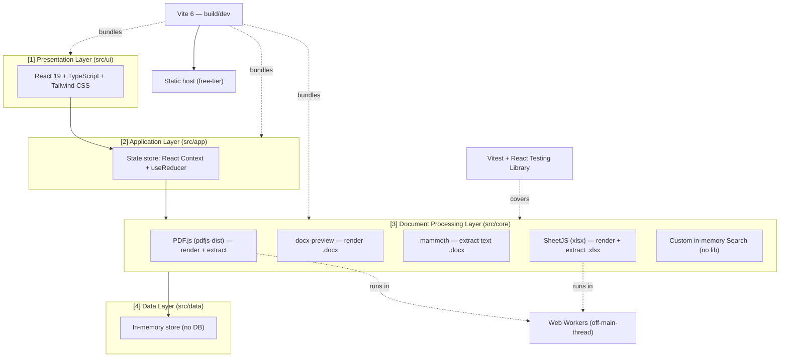

# 🏗️ ADR-001 — Tech Stack (DocsViewer MVP)

## Mục lục

1. [Context (Bối cảnh)](#1-context-bối-cảnh)
2. [Decision (Quyết định)](#2-decision-quyết-định)
   1. [Tổng quan Stack](#21-tổng-quan-stack)
   2. [Why — Lý do từng lựa chọn trọng yếu](#22-why--lý-do-từng-lựa-chọn-trọng-yếu)
   3. [License posture](#23-license-posture)
   4. [Sơ đồ ánh xạ Layer ↔ Library](#24-sơ-đồ-ánh-xạ-layer--library)
3. [Status (Trạng thái)](#3-status-trạng-thái)
4. [Consequences (Hệ quả)](#4-consequences-hệ-quả)
   1. [Pros (Lợi ích)](#41-pros-lợi-ích)
   2. [Cons (Bất lợi)](#42-cons-bất-lợi)
   3. [Trade-offs (Đánh đổi)](#43-trade-offs-đánh-đổi)
5. [Alternatives considered (Phương án đã cân nhắc)](#5-alternatives-considered-phương-án-đã-cân-nhắc)
6. [Tài liệu tham khảo](#6-tài-liệu-tham-khảo)

---

## 1. Context (Bối cảnh)

DocsViewer ở milestone **M1 (MVP)** là một **web app client-side SPA**: 100% xử lý parse/render/extract diễn ra **trong browser**, không có backend và không có database (xem chi tiết quyết định client-side tại [ADR-002](./ADR-002-Client-Side-Processing.md)). Bối cảnh này áp đặt một bộ ràng buộc nền tảng lên mọi lựa chọn công nghệ:

- **Render fidelity là rủi ro số 1** ([R-01](../../010-Planning/Risk-Register.md#2-risk-log) — rủi ro trọng yếu): render `.docx`/`.xlsx`/PDF trên browser khó đạt độ trung thực như app desktop. Stack phải dựa vào các thư viện render/parse **mạnh nhất** trong hệ sinh thái web để đạt ngưỡng *Acceptable Fidelity* định nghĩa tại [NFR-02](../../020-Requirements/NFR-DocsViewer.md#-nfr-02--render-fidelity-độ-trung-thực-render).
- **Tài nguyên solo dev + AI** ([Charter §7.2](../../010-Planning/Charter-DocsViewer.md#72-ràng-buộc-constraints)): phải tuân **KISS/YAGNI**, ưu tiên OSS lib phổ biến, cộng đồng lớn, tránh over-engineering — tức ưu tiên **maintainability** ([NFR-09](../../020-Requirements/NFR-DocsViewer.md#2-bảng-nfr)).
- **Phụ thuộc thư viện open-source** ([R-06](../../010-Planning/Risk-Register.md#2-risk-log)): cần lib có cộng đồng lớn, còn được maintain tích cực, và license tương thích để giảm rủi ro bug/bỏ maintain/xung đột pháp lý.
- **Compatibility baseline:** stack lấy **trình duyệt hiện đại làm mục tiêu tương thích** ([NFR-08](../../020-Requirements/NFR-DocsViewer.md#2-bảng-nfr)) — đây cũng là điều kiện cho phép dựa vào các năng lực nền tảng web hiện đại (Web Workers, Canvas, ES modules).
- **Ràng buộc tài nguyên & hiệu năng:** stack phải đáp ứng mục tiêu thời gian mở trang đầu ([NFR-01](../../020-Requirements/NFR-DocsViewer.md#2-bảng-nfr)), trong khi parse client-side tạo nhiều bản sao in-memory gây áp lực bộ nhớ trình duyệt ([NFR-07](../../020-Requirements/NFR-DocsViewer.md#2-bảng-nfr), [R-05](../../010-Planning/Risk-Register.md#2-risk-log)).
- **Ngân sách cá nhân / free-tier** ([Charter §7.2](../../010-Planning/Charter-DocsViewer.md#72-ràng-buộc-constraints)): không trả phí hạ tầng; deploy static.

ADR này **chỉ quyết định bộ công nghệ (tech stack)**. Các quyết định về cấu trúc kiến trúc layered, pattern Adapter + Registry, và `StorageProvider` port thuộc về [ADR-002](./ADR-002-Client-Side-Processing.md), [ADR-003](./ADR-003-Layered-Adapter-Registry.md), [ADR-004](./ADR-004-Data-Layer-Separation.md). Các ngưỡng `MAX_FILE_SIZE` thuộc về SDD. ADR này tham chiếu chúng, không quyết định thay.

---

## 2. Decision (Quyết định)

### 2.1. Tổng quan Stack

Chốt bộ công nghệ MVP như sau (đã thống nhất với PO/trisjr):

| Lớp | Lựa chọn | Vai trò trong hệ thống |
| :-- | :-- | :-- |
| Language | **TypeScript 5.x** | Type-safe Module Contracts (KR3.1), nền tảng maintainability (NFR-09). |
| Framework | **React 19** | Presentation Layer; hệ sinh thái lớn nhất, AI-support tốt. |
| Build / Dev | **Vite 6** | Dev server + bundler tối ưu cho SPA. |
| Styling / UI | **Tailwind CSS v4** (+ Radix/Headless UI on-demand) | Styling cho chrome/shell ở Presentation Layer; utility-first, no runtime JS. |
| PDF | **PDF.js (`pdfjs-dist`)** | Render canvas + extract text (`page.getTextContent()`). |
| DOCX render | **docx-preview** | Render `.docx` → HTML giữ layout (fidelity). |
| DOCX extract | **mammoth (`extractRawText`)** | Bóc text sạch cho extraction accuracy. |
| XLSX | **SheetJS (`xlsx`, community)** | Parse + render grid (`sheet_to_html`) + extract (`sheet_to_json`). |
| State management | **React built-in (Context + useReducer)** | State store của Application Layer; không Redux ở MVP. |
| Search | **Custom in-memory (no lib)** | Logic substring trên nội dung đã trích xuất. |
| Test | **Vitest + React Testing Library** | Đồng bộ Vite; phục vụ testability (QA Phase 5). |
| Heavy parsing | **Web Workers** | Off-main-thread cho PDF.js/SheetJS. |
| Deploy | **Static host (Vercel / Netlify / GitHub Pages free-tier)** | Hosting free-tier. |

> [!NOTE]
> Các interface (`DocumentAdapter`, `DocumentService`, `SearchEngine`, `StorageProvider`...) viết bằng TypeScript được đặc tả tại [Spec-Module-Contracts](../API/Spec-Module-Contracts.md); ràng buộc tích hợp & license của từng OSS library tại [Spec-Integration-OSS-Libraries](../API/Spec-Integration-OSS-Libraries.md).

### 2.2. Why — Lý do từng lựa chọn trọng yếu

**TypeScript 5.x.** Toàn bộ ranh giới giữa các lớp (Presentation → Application → Core → Data) được biểu diễn bằng interface. TypeScript cho phép kiểm tra hợp đồng tại compile-time, giúp giữ Core tách rời UI/danh tính người dùng (KR3.1) và là yếu tố cốt lõi của maintainability (NFR-09). Đây là điều kiện tiên quyết cho mọi pattern trong ADR-003/004.

**React 19 (Framework).** Được PO chọn. Lý do kiến trúc: React có **hệ sinh thái và cộng đồng lớn nhất** trong các UI framework hiện nay, kéo theo (a) độ sẵn có cao của ví dụ tích hợp với các document library (PDF.js/docx-preview/SheetJS), (b) chất lượng AI-support tốt nhất cho mô hình solo-dev-cùng-AI ([Charter §6](../../010-Planning/Charter-DocsViewer.md#6-stakeholders--raci-matrix)), (c) độ ổn định và tuổi đời cao → giảm R-06. Tất cả phục vụ trực tiếp NFR-09.

**Vite 6 (Build/Dev).** Dev server HMR nhanh và bundle production tối ưu (code-splitting, tree-shaking) hỗ trợ mục tiêu thời gian mở trang đầu (NFR-01) và DX tốt cho solo dev (NFR-09). Vite cũng là nền tảng tự nhiên cho Vitest (cùng hệ cấu hình) → giảm chi phí bảo trì test pipeline.

**Tailwind CSS v4 (Styling/UI).** UI của DocsViewer chia hai phần: *content area* (vùng render tài liệu) do chính PDF.js (canvas) / docx-preview (HTML) / SheetJS (`sheet_to_html`) **tự sinh ra**, và *chrome/shell* (UploadZone, toolbar, SearchBar, ExtractedContentPanel, ErrorBanner) — phần chrome nhỏ và đơn giản. Vì content area đã do lib render, một **component library nặng (MUI/Ant/Chakra) là thừa** và kéo bundle lớn → vi phạm YAGNI (NFR-09) và đe dọa NFR-01. Tailwind utility-first **không có runtime JS**, purge ra CSS nhỏ (hỗ trợ NFR-01), tốc độ dev cao và AI-support tốt cho mô hình solo-dev-cùng-AI (NFR-09, [R-07](../../010-Planning/Risk-Register.md#2-risk-log)), license MIT cộng đồng lớn (giảm R-06). Khi cần primitive accessible (dropdown sheet-tabs, modal lỗi) sẽ thêm **Radix UI / Headless UI** (headless, nhẹ) **on-demand** — không bắt buộc MVP (YAGNI). *Caveat tích hợp:* Tailwind **preflight** (CSS reset) phải được **cô lập khỏi content area** để không phá CSS mà docx-preview/SheetJS sinh ra — chi tiết tại [Spec-Integration-OSS-Libraries](../API/Spec-Integration-OSS-Libraries.md). *Ranh giới:* ADR này chỉ chốt **CSS tooling**; **design system visual** (màu, spacing, design tokens, component layout) thuộc Phase 3 (Product Designer).

**PDF.js (`pdfjs-dist`) cho PDF.** Đây là engine PDF chín muồi nhất chạy thuần trong browser, do Mozilla maintain, vừa render (canvas) vừa extract text (`page.getTextContent()`), và **đã có sẵn worker model** off-main-thread. Là lựa chọn mạnh nhất để giảm R-01 (render fidelity) và đáp ứng NFR-02; đồng thời phục vụ extraction (NFR-03) trên cùng một lib → giảm số phụ thuộc.

**docx-preview + mammoth — chiến lược 2 thư viện cho `.docx`.** Đây là một quyết định có chủ đích, tách bạch **hai mục tiêu mâu thuẫn nhau**:

- *Render fidelity* (R-01/NFR-02) cần giữ tối đa cấu trúc/định dạng (heading, bảng, hình, danh sách lồng) → **docx-preview** render `.docx` thành HTML giàu cấu trúc.
- *Extraction accuracy* (NFR-03) cần text **sạch, tuyến tính**, không nhiễu markup → **mammoth (`extractRawText`)** cho ra plain text thuần để feed search/AI.

Một thư viện tối ưu cho fidelity (HTML giàu markup) sẽ là nguồn text bẩn nếu dùng để extract; ngược lại một thư viện tối ưu cho text sạch sẽ làm hỏng fidelity render. Tách rõ hai lib cho hai trách nhiệm là cách trung thực nhất để **đồng thời** đạt cả NFR-02 lẫn NFR-03 — đánh đổi là +1 dependency (bàn ở §4.3).

**SheetJS (`xlsx`, community) cho `.xlsx`.** Một thư viện duy nhất phục vụ cả ba nhu cầu: parse workbook, render grid (`sheet_to_html`) cho fidelity (NFR-02), và extract data dạng bảng (`sheet_to_json`) cho extraction (NFR-03). Gộp ba trách nhiệm vào một lib chín muồi giúp giữ KISS (NFR-09) — khác với `.docx` vì SheetJS đã tách sẵn API render và API extract trong cùng package.

**State: React Context + useReducer (không Redux).** MVP single-user, một tài liệu mở trong một session → trạng thái nhỏ và cục bộ. Context + useReducer là đủ; thêm Redux là over-engineering, vi phạm YAGNI/KISS (NFR-09, [R-07](../../010-Planning/Risk-Register.md#2-risk-log)).

**Search: custom in-memory (không thư viện).** Logic là substring match diacritic-/case-insensitive trên nội dung đã trích xuất của một tài liệu duy nhất. Một full-text engine (vd Lunr/FlexSearch) là thừa cho phạm vi single-document MVP — giữ KISS (NFR-09).

**Vitest + React Testing Library.** Chạy chung hệ cấu hình với Vite (không cần Jest + babel-jest riêng) → giảm chi phí bảo trì. Phục vụ testability cho giai đoạn QA (NFR-09).

**Web Workers (Heavy parsing).** Parse PDF/`.xlsx` là tác vụ nặng CPU/bộ nhớ. Đặt chúng off-main-thread giữ UI không bị block, hỗ trợ mục tiêu thời gian mở trang đầu (NFR-01) và quản lý áp lực bộ nhớ trình duyệt (NFR-07). Web Workers là API chuẩn của trình duyệt hiện đại — khả dụng nhờ chính baseline compatibility ở NFR-08. Lưu ý: việc *chọn Web Workers như một công nghệ* thuộc ADR này; *pattern offloading trong kiến trúc Core* được đặc tả ở [ADR-003](./ADR-003-Layered-Adapter-Registry.md).

**Static host (free-tier).** Vì là SPA client-side không backend, có thể deploy static lên Vercel/Netlify/GitHub Pages free-tier — phù hợp ràng buộc ngân sách cá nhân ([Charter §7.2](../../010-Planning/Charter-DocsViewer.md#72-ràng-buộc-constraints)).

### 2.3. License posture

Toàn bộ thư viện trong stack thuộc **họ license permissive (Apache-2.0 / MIT / BSD)**, tương thích lẫn nhau và phù hợp cho personal/commercial use — đáp ứng tiêu chí "license tương thích" của NFR-09 và giảm thiểu R-06. Trong đó, hai thư viện lõi cho render/extract đã xác nhận thuộc **Apache-2.0**: **PDF.js (`pdfjs-dist`)** và **SheetJS (`xlsx`)**. Đặc tả license đầy đủ theo từng library (kèm verify version & maintenance status) là trách nhiệm của [Spec-Integration-OSS-Libraries](../API/Spec-Integration-OSS-Libraries.md) — nơi ghi rõ SPDX identifier sau khi pin version thực tế.

### 2.4. Sơ đồ ánh xạ Layer ↔ Library

> Sơ đồ minh hoạ *thư viện nào thuộc lớp nào*; ranh giới phụ thuộc 1 chiều (Presentation → Application → Core → Data) và các pattern liên quan được đặc tả tại [ADR-003](./ADR-003-Layered-Adapter-Registry.md).

---

## 3. Status (Trạng thái)

**Proposed.**

ADR này **supersedes** stub rỗng `ADR-001-Init-Architecture` đã được loại bỏ — thư mục `docs/030-Specs/Architecture/` đã được xác minh là trống trước khi viết, nên không còn nội dung kế thừa. Sau khi được PO/trisjr phê duyệt, status chuyển `accepted`.

---

## 4. Consequences (Hệ quả)

### 4.1. Pros (Lợi ích)

- **Render fidelity tối đa khả thi trên web** nhờ chọn các engine mạnh nhất theo từng định dạng (PDF.js, docx-preview, SheetJS) → giảm trực tiếp R-01, đặt nền cho NFR-02.
- **Extraction sạch** nhờ tách lib extract (mammoth / SheetJS `sheet_to_json` / PDF.js text) → hỗ trợ NFR-03 và chất lượng search downstream.
- **Maintainability cao** (NFR-09): toàn bộ stack là OSS phổ biến, cộng đồng lớn, AI-support tốt; TypeScript bảo vệ hợp đồng giữa các lớp.
- **License sạch**: toàn bộ thuộc họ permissive → giảm R-06, không vướng nghĩa vụ copyleft.
- **Hiệu năng & responsiveness**: Vite tối ưu bundle + Web Workers off-main-thread → hỗ trợ NFR-01/NFR-07.
- **Chi phí 0**: SPA static deploy free-tier → khớp ràng buộc ngân sách cá nhân.

### 4.2. Cons (Bất lợi)

- **Phụ thuộc nhiều OSS library** cho phần lõi (render/extract); chất lượng sản phẩm bị chặn trên bởi chất lượng các lib này (R-06) — không thể đạt fidelity vượt quá khả năng của chúng.
- **Số lượng dependency tăng** do chiến lược 2-lib cho `.docx` (docx-preview + mammoth), làm bề mặt bảo trì/cập nhật lớn hơn.
- **Giới hạn của render client-side**: fidelity tuyệt đối (pixel-perfect) là bất khả thi — đây là lý do NFR-02 đặt mục tiêu *Acceptable Fidelity* thay vì pixel-perfect.

### 4.3. Trade-offs (Đánh đổi)

- **docx-preview vs mammoth (2 lib cho `.docx`):** đánh đổi *+1 dependency* để lấy *sự tách bạch rõ ràng giữa render fidelity và clean-text extraction*. Quyết định: **chấp nhận**, vì gộp hai trách nhiệm vào một lib sẽ buộc hy sinh NFR-02 hoặc NFR-03 — một đánh đổi tệ hơn nhiều so với chi phí bảo trì thêm một thư viện. (Tương phản: `.xlsx` chỉ cần một lib vì SheetJS đã tách sẵn API render và API extract.)
- **React vs alternative nhẹ hơn (Svelte/vanilla):** đánh đổi *bundle nhỉnh hơn* để lấy *hệ sinh thái + AI-support + cộng đồng lớn nhất* — ưu tiên maintainability (NFR-09) hơn tối ưu kích thước bundle ở MVP; bundle vẫn được Vite tối ưu đủ cho NFR-01.
- **Context + useReducer vs Redux:** đánh đổi *thiếu công cụ devtools/middleware mạnh* để lấy *đơn giản* (KISS/YAGNI). Nếu state phình to ở M2+, có thể nâng cấp sau mà không phá Core (state thuộc Application Layer).

---

## 5. Alternatives considered (Phương án đã cân nhắc)

### Framework: Vue vs Svelte vs Vanilla JS vs **React (chọn)**

- **Vue:** hệ sinh thái và AI-support tốt, DX cao, reactivity tinh gọn. Lý do không chọn: cộng đồng và độ phong phú ví dụ tích hợp document-library nhỏ hơn React; lợi ích không đủ để lệch khỏi lựa chọn của PO (NFR-09).
- **Svelte:** bundle nhỏ nhất, runtime overhead thấp — hấp dẫn cho NFR-01. Lý do không chọn: hệ sinh thái và AI-support nhỏ hơn đáng kể, làm tăng R-06 và chi phí cho mô hình solo-dev-cùng-AI; lợi thế bundle không quyết định vì các nút thắt hiệu năng thật nằm ở parse/render lib, được giải bằng Web Workers chứ không phải framework.
- **Vanilla JS (không framework):** zero dependency, kiểm soát tối đa. Lý do không chọn: chi phí tự xây quản lý state/rendering/Unified Viewer cho 3 định dạng quá lớn cho solo dev → vi phạm KISS/YAGNI (NFR-09) và làm phình bandwidth solo dev (R-07).
- **React (chọn):** cộng đồng/hệ sinh thái lớn nhất, AI-support tốt nhất, dễ tích hợp document library → tối ưu cho NFR-09 và giảm R-06. Đã được PO chọn.

### PDF: PDF.js (chọn) vs alternatives

- Các thư viện PDF khác (render qua iframe/embed của trình duyệt, hoặc lib thương mại) hoặc *không cho extract text có cấu trúc* (vi phạm NFR-03), hoặc *không miễn phí/không permissive* (vi phạm R-06/NFR-09). **PDF.js** vừa render vừa extract, Apache-2.0, có worker sẵn → là lựa chọn mạnh nhất cho R-01.

### DOCX: một-thư-viện vs **hai-thư-viện (chọn)**

- **Chỉ docx-preview:** đủ render nhưng text trích từ HTML render bị nhiễu markup → hạ NFR-03.
- **Chỉ mammoth:** text sạch nhưng `convertToHtml` của mammoth giản lược cấu trúc/định dạng → hạ NFR-02.
- **docx-preview (render) + mammoth `extractRawText` (extract) — chọn:** mỗi lib làm đúng một việc tốt nhất; đáp ứng đồng thời NFR-02 và NFR-03 (xem §2.2 và trade-off §4.3).

### State: Redux / Zustand vs **Context + useReducer (chọn)**

- **Redux/Zustand:** mạnh cho app lớn nhiều global state. Lý do không chọn: thừa cho MVP single-user single-document → vi phạm YAGNI (NFR-09); có thể nâng cấp ở M2+ nếu cần mà không đụng Core.

### Search: full-text lib (Lunr/FlexSearch) vs **custom in-memory (chọn)**

- **Lib full-text:** mạnh cho cross-document/ranking. Lý do không chọn: phạm vi MVP là in-document single-document substring search → custom code đơn giản hơn, ít dependency hơn (KISS, NFR-09). Cross-document search đã được defer M2 theo [PRD §8](../../020-Requirements/PRD-DocsViewer.md#8-out-of-scope--deferred).

### Styling: **Tailwind CSS (chọn)** vs CSS Modules vs shadcn/ui vs component library nặng

- **CSS Modules / vanilla CSS:** zero dependency, không xung đột preflight, nhưng phải tự viết scale/spacing/responsive bằng tay → chậm cho solo dev (R-07), dễ thiếu nhất quán.
- **Component library nặng (MUI/Ant/Chakra):** có sẵn component đẹp/accessible nhưng bundle nặng (đe dọa NFR-01), over-engineering cho một viewer chrome nhỏ (YAGNI), lock-in design, tăng R-06.
- **shadcn/ui (Tailwind + Radix prebuilt):** component copy-in đẹp/accessible, nhưng mang nhiều hơn mức cần cho chrome nhỏ của MVP (YAGNI nhẹ); có thể cân nhắc ở M2+ nếu UI phình.
- **Tailwind CSS (chọn):** cân bằng tốt nhất — nhẹ (no runtime, purge), nhanh, AI-support cao, MIT; thêm Radix/Headless on-demand cho a11y. Tối ưu KISS/NFR-09 + NFR-01 + R-07. Đã được PO/trisjr chọn.

---

## 6. Tài liệu tham khảo

- [PRD — DocsViewer](../../020-Requirements/PRD-DocsViewer.md)
- [SRS — DocsViewer](../../020-Requirements/SRS-DocsViewer.md)
- [NFR — DocsViewer](../../020-Requirements/NFR-DocsViewer.md)
- [OKRs](../../010-Planning/OKRs.md)
- [Risk Register](../../010-Planning/Risk-Register.md)
- [Project Charter — DocsViewer](../../010-Planning/Charter-DocsViewer.md)
- [Glossary — DocsViewer](../../999-Resources/Glossary.md)
- [ADR-002 — Client-Side Processing](./ADR-002-Client-Side-Processing.md)
- [ADR-003 — Layered Adapter Registry](./ADR-003-Layered-Adapter-Registry.md)
- [ADR-004 — Data Layer Separation](./ADR-004-Data-Layer-Separation.md)
- [Spec — Module Contracts](../API/Spec-Module-Contracts.md)
- [Spec — Integration OSS Libraries](../API/Spec-Integration-OSS-Libraries.md)

---
*Generated by TNMCORE-OS Architect Role.*
