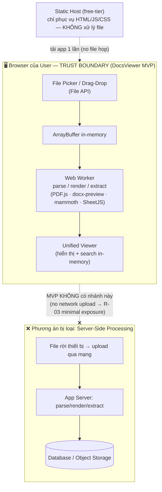

# ADR-002 — Client-Side Processing (Xử lý 100% tại Browser)

## Mục lục

1. [Context (Bối cảnh)](#1-context-bối-cảnh)
2. [Decision (Quyết định)](#2-decision-quyết-định)
3. [Status (Trạng thái)](#3-status-trạng-thái)
4. [Consequences (Hệ quả)](#4-consequences-hệ-quả)
   - [4.1. Pros (Lợi ích)](#41-pros-lợi-ích)
   - [4.2. Cons (Bất lợi)](#42-cons-bất-lợi)
   - [4.3. Trade-offs (Đánh đổi)](#43-trade-offs-đánh-đổi)
5. [Alternatives Considered (Phương án đã cân nhắc)](#5-alternatives-considered-phương-án-đã-cân-nhắc)
6. [Tài liệu tham khảo](#tài-liệu-tham-khảo)

---

## 1. Context (Bối cảnh)

DocsViewer ở milestone **M1 (MVP)** là một web app phục vụ **single-user** (trisjr — first user/solo developer), với hai năng lực lõi: **View** và **Extract** nội dung của 3 định dạng `.docx`, `.xlsx`, PDF (xem [PRD §1](../../020-Requirements/PRD-DocsViewer.md), [FR-01..FR-11](../../020-Requirements/PRD-DocsViewer.md)). Câu hỏi kiến trúc cốt lõi của Phase-2 là: **nơi nào thực thi việc parse/render/extract tài liệu — backend server hay chính trình duyệt của người dùng?**

Bối cảnh ràng buộc quyết định này:

- **Định vị sản phẩm "self-contained, client-side".** [PRD §1](../../020-Requirements/PRD-DocsViewer.md) đặt giá trị cốt lõi là *"Xem mọi tài liệu ở một nơi"* ngay trên trình duyệt, **không cần cài đặt phần mềm chuyên dụng**. Đây là một định vị về sự đơn giản và tự chủ — tải file lên là xem được ngay.
- **Phạm vi MVP đã khóa cứng.** [PRD §8 (Out of Scope / Deferred)](../../020-Requirements/PRD-DocsViewer.md) xếp **Auth & Multi-tenancy đầy đủ** (threat model, lưu trữ) vào **defer M3** — MVP chỉ cần validate core View + Extract. Mọi thứ liên quan tới định danh người dùng, lưu trữ lâu dài và phân tách dữ liệu chưa cần ở M1.
- **Ràng buộc nguồn lực & ngân sách.** [Charter §7.2](../../010-Planning/Charter-DocsViewer.md) quy định: 1 developer + AI ⇒ ưu tiên **KISS/YAGNI**; ngân sách cá nhân ⇒ ưu tiên **open-source & free-tier hosting**. Vận hành một backend (compute parse tài liệu nặng, lưu trữ, monitoring) phát sinh chi phí hạ tầng và gánh nặng vận hành mâu thuẫn trực tiếp với ràng buộc này — đồng thời làm tăng [R-07](../../010-Planning/Risk-Register.md) (bandwidth solo dev).
- **Privacy của tài liệu nhạy cảm.** [R-03](../../010-Planning/Risk-Register.md) và [NFR-05](../../020-Requirements/NFR-DocsViewer.md) chỉ ra tài liệu người dùng upload thường **nhạy cảm**; mọi thao tác đẩy file qua mạng (network upload) đều mở rộng attack surface và bề mặt lộ dữ liệu.
- **Ràng buộc nền tảng Web.** [Charter §7.2](../../010-Planning/Charter-DocsViewer.md) thừa nhận web app chịu các giới hạn của trình duyệt (kích thước file, bộ nhớ, độ trung thực render) — đây là cái giá kỹ thuật của việc xử lý tại client mà ta phải chủ động quản lý ([NFR-07](../../020-Requirements/NFR-DocsViewer.md), [R-05](../../010-Planning/Risk-Register.md)).

> [!NOTE]
> ADR này **chỉ** chốt *nơi* xử lý (browser, không backend, không DB). *Cách* tổ chức lớp xử lý là [ADR-003](./ADR-003-Layered-Adapter-Registry.md); *cơ chế* tách lớp dữ liệu người dùng và điểm móc defer auth/multi-tenant M3 là [ADR-004](./ADR-004-Data-Layer-Separation.md).

---

## 2. Decision (Quyết định)

DocsViewer MVP (M1) thực thi **100% việc parse / render / extract tài liệu trong browser** của người dùng. Cụ thể:

1. **Không có backend.** Không có application server thực hiện parse/render/extract; không có REST API server-side trong MVP. Các thư viện xử lý (PDF.js, docx-preview, mammoth, SheetJS — xem [ADR-001](./ADR-001-Tech-Stack.md)) chạy hoàn toàn trên client, off-main-thread qua **Web Workers**.
2. **Không có Database.** Không có DB persistence ở MVP. Trạng thái tài liệu là **in-memory/runtime**, sống theo session và bị giải phóng khi session kết thúc (xem Domain Data Model tại [ADR-004](./ADR-004-Data-Layer-Separation.md) và `DB-Entity-DocsViewer`).
3. **File không rời thiết bị.** File người dùng chọn được nạp trực tiếp vào browser (File API → `ArrayBuffer`), parse tại chỗ; **không** upload qua mạng tới bất kỳ server nào.
4. **Static hosting.** App được deploy dưới dạng static assets trên **free-tier** (Vercel/Netlify/GitHub Pages) — không có compute phía server ([Charter §7.2](../../010-Planning/Charter-DocsViewer.md)).
5. **Auth / Storage / Multi-tenant defer M3.** MVP không triển khai authentication, lưu trữ lâu dài hay phân tách dữ liệu đa tenant ([PRD §8](../../020-Requirements/PRD-DocsViewer.md), [NFR-05](../../020-Requirements/NFR-DocsViewer.md)). Điểm móc (extension point) cho các năng lực này được chừa sẵn ở Data Layer dưới dạng *port*, mô tả tại [ADR-004](./ADR-004-Data-Layer-Separation.md) (thỏa [KR3.3](../../010-Planning/OKRs.md)) — **không** hiện thực ở M1.

**Why (Tại sao chọn hướng này):** Client-side processing là phương án **đồng thời** thỏa định vị sản phẩm ([PRD §1](../../020-Requirements/PRD-DocsViewer.md): self-contained), ràng buộc ngân sách ([Charter §7.2](../../010-Planning/Charter-DocsViewer.md): free-tier + KISS/YAGNI) và mục tiêu privacy ([NFR-05](../../020-Requirements/NFR-DocsViewer.md), [R-03](../../010-Planning/Risk-Register.md): no upload = bề mặt lộ dữ liệu tối thiểu). Nó là *privacy by design*: dữ liệu nhạy cảm không bao giờ rời thiết bị người dùng. Đây là lựa chọn **YAGNI** điển hình — không xây hạ tầng server cho năng lực mà MVP chưa cần ([PRD §8](../../020-Requirements/PRD-DocsViewer.md)).

### Trust Boundary & Data Flow (so sánh với phương án bị loại)

---

## 3. Status (Trạng thái)

**Accepted** — phê duyệt bởi trisjr (Accountable) ngày 2026-06-25; Security Auditor đã sign-off (mandatory gate Phase-2 — [Spec-Security §7](../Security/Spec-Security-DocsViewer.md#7-security-auditor-review)). Liên đới chặt chẽ với [ADR-001 (Tech Stack)](./ADR-001-Tech-Stack.md), [ADR-003 (Layered + Adapter-Registry)](./ADR-003-Layered-Adapter-Registry.md) và [ADR-004 (Data-Layer Separation)](./ADR-004-Data-Layer-Separation.md).

---

## 4. Consequences (Hệ quả)

### 4.1. Pros (Lợi ích)

- **Privacy by design ([R-03](../../010-Planning/Risk-Register.md) · [NFR-05](../../020-Requirements/NFR-DocsViewer.md)):** file không rời thiết bị ⇒ **không** network upload ⇒ bề mặt lộ dữ liệu tối thiểu. Đây là mitigation kiến trúc trực tiếp cho rủi ro bảo mật tài liệu nhạy cảm.
- **Chi phí hạ tầng ~0 ([Charter §7.2](../../010-Planning/Charter-DocsViewer.md)):** static hosting trên free-tier, không compute server, không hóa đơn cloud cho parse/storage — khớp ràng buộc ngân sách cá nhân.
- **Đơn giản vận hành ([NFR-09](../../020-Requirements/NFR-DocsViewer.md) · KISS/YAGNI):** không có server để deploy/scale/monitor/patch ⇒ giảm tải vận hành cho solo dev (giảm [R-07](../../010-Planning/Risk-Register.md)).
- **Trải nghiệm "self-contained" ([PRD §1](../../020-Requirements/PRD-DocsViewer.md)):** tải file là xem ngay, không phụ thuộc round-trip mạng cho việc render — hỗ trợ mục tiêu mở trang đầu nhanh ([NFR-01](../../020-Requirements/NFR-DocsViewer.md)).
- **Không khóa hướng mở rộng M3:** việc *không* có backend ở MVP không cản trở thêm server về sau, vì điểm móc đã được chừa ở Data Layer ([KR3.3](../../010-Planning/OKRs.md), cơ chế tại [ADR-004](./ADR-004-Data-Layer-Separation.md)).

### 4.2. Cons (Bất lợi)

- **Giới hạn bộ nhớ & kích thước file trình duyệt ([NFR-07](../../020-Requirements/NFR-DocsViewer.md) · [R-05](../../010-Planning/Risk-Register.md)):** parse client-side tạo nhiều bản sao in-memory; trình duyệt có trần bộ nhớ. Phải áp **`MAX_FILE_SIZE`** per-format (giá trị chốt tại NFR §4.1 / SDD §Resource Limits — **không** restate ở đây) và cân nhắc lazy render/phân trang. File vượt ngưỡng bị từ chối với thông báo nêu rõ giới hạn ([UC-02 E2](../../020-Requirements/Use-Cases/UC-02-Upload-View-Document.md)).
- **Không có xử lý server-side:** không thể tận dụng compute mạnh/đồng nhất phía server cho các tác vụ nặng (vd OCR, structured extraction) — phù hợp vì các năng lực đó vốn đã defer M2/M3 ([PRD §8](../../020-Requirements/PRD-DocsViewer.md)).
- **Hiệu năng phụ thuộc thiết bị người dùng:** thời gian render/extract biến thiên theo CPU/RAM máy client; được quản lý bằng Web Worker offloading + baseline fixture đo [NFR-01](../../020-Requirements/NFR-DocsViewer.md).
- **Không persist dữ liệu ([NFR-05](../../020-Requirements/NFR-DocsViewer.md)):** đóng tab là mất session — chấp nhận được ở MVP single-user (đồng thời là một thuộc tính privacy có chủ đích, không phải khiếm khuyết).

### 4.3. Trade-offs (Đánh đổi)

- **Đánh đổi compute server lấy privacy + chi phí + đơn giản.** Ta từ bỏ sức mạnh xử lý phía server (và khả năng xử lý file rất lớn) để đổi lấy bề mặt lộ dữ liệu tối thiểu ([R-03](../../010-Planning/Risk-Register.md)), chi phí ~0 ([Charter §7.2](../../010-Planning/Charter-DocsViewer.md)) và độ đơn giản vận hành ([NFR-09](../../020-Requirements/NFR-DocsViewer.md)). Với MVP single-user, cán cân nghiêng rõ về phía client-side.
- **`MAX_FILE_SIZE` là van điều tiết, không phải tường cứng vĩnh viễn.** Ngưỡng là **tunable** sau khi đo perf thực tế ([NFR-07](../../020-Requirements/NFR-DocsViewer.md) / [R-05](../../010-Planning/Risk-Register.md)); ta chấp nhận giới hạn rõ ràng có thể truyền đạt cho người dùng thay vì rủi ro crash do quá tải bộ nhớ.
- **Tự chủ kiến trúc ở M1 đổi lấy chi phí mở rộng ở M3.** Khi lên multi-tenant (M3) sẽ phải bổ sung backend; chi phí đó được kiểm soát nhờ tách lớp dữ liệu sẵn từ MVP ([KR3.1/KR3.3](../../010-Planning/OKRs.md), [ADR-004](./ADR-004-Data-Layer-Separation.md)) ⇒ **không phải viết lại core** ([NFR-06](../../020-Requirements/NFR-DocsViewer.md)).

---

## 5. Alternatives Considered (Phương án đã cân nhắc)

### A. Server-Side Rendering / Extraction (BỊ LOẠI)

**Mô tả:** File được upload qua mạng lên application server; server thực hiện parse/render/extract (có thể dùng headless office/converter), trả về kết quả (ảnh/HTML/text) cho client; dữ liệu lưu trong DB/object storage.

**Lý do loại:**
- **Chi phí & hạ tầng:** cần compute server thường trực + storage + monitoring ⇒ phát sinh hóa đơn cloud, mâu thuẫn ràng buộc free-tier/ngân sách cá nhân ([Charter §7.2](../../010-Planning/Charter-DocsViewer.md)) và tăng gánh vận hành solo dev ([R-07](../../010-Planning/Risk-Register.md)).
- **Mở rộng attack surface / privacy:** file nhạy cảm rời thiết bị và được lưu phía server ⇒ tăng bề mặt lộ dữ liệu, đi ngược mục tiêu [NFR-05](../../020-Requirements/NFR-DocsViewer.md) / [R-03](../../010-Planning/Risk-Register.md) và kéo theo nghĩa vụ threat model vốn đã được defer M3.
- **Mâu thuẫn phạm vi MVP:** xây backend là giải pháp cho bài toán multi-user/lưu trữ ([PRD §8](../../020-Requirements/PRD-DocsViewer.md) defer M3) — vi phạm YAGNI ([NFR-09](../../020-Requirements/NFR-DocsViewer.md)) khi MVP chỉ cần validate core View + Extract.

### B. Hybrid (Client + Server fallback) (BỊ LOẠI)

**Mô tả:** Mặc định xử lý ở client; chỉ đẩy lên server cho các trường hợp "khó" (file rất lớn vượt trần bộ nhớ, hoặc tác vụ nặng như OCR/structured extraction). Client-side cho phần lớn case, server gánh phần biên.

**Lý do loại:**
- **Chi phí vận hành kép:** vẫn phải dựng và bảo trì toàn bộ hạ tầng server cho một nhánh fallback ít dùng ⇒ không đạt mục tiêu chi phí ~0 ([Charter §7.2](../../010-Planning/Charter-DocsViewer.md)), trong khi độ phức tạp (hai code path, đồng bộ logic client/server) cao hơn cả hai phương án thuần — vi phạm KISS ([NFR-09](../../020-Requirements/NFR-DocsViewer.md)).
- **Kéo privacy về mức server-side cho nhánh fallback:** ngay khi có một đường file rời thiết bị, ta phải xử lý threat model cho nhánh đó ([NFR-05](../../020-Requirements/NFR-DocsViewer.md) / [R-03](../../010-Planning/Risk-Register.md)) — defer M3 không còn sạch.
- **Giải bài toán chưa tồn tại:** các case cần fallback (file siêu lớn, OCR, structured extraction) đều đã defer M2/M3 ([PRD §8](../../020-Requirements/PRD-DocsViewer.md)). Áp `MAX_FILE_SIZE` ([NFR-07](../../020-Requirements/NFR-DocsViewer.md)) ở client là cách KISS hơn để chặn file vượt trần, thay vì dựng server fallback — YAGNI.

> [!NOTE]
> Hybrid là **ứng viên hợp lý cho M3** khi multi-tenant đã bật và bài toán file lớn/OCR trở nên thực tế. Quyết định này **không** đóng cửa hướng đó — điểm móc Data Layer ([ADR-004](./ADR-004-Data-Layer-Separation.md)) cho phép gắn `ServerStorageProvider`/compute backend về sau mà không sửa Core ([KR3.2/KR3.3](../../010-Planning/OKRs.md)).

---

## Tài liệu tham khảo

- [PRD — DocsViewer](../../020-Requirements/PRD-DocsViewer.md) (§1 self-contained client-side · §8 Out of Scope / Deferred)
- [NFR — DocsViewer](../../020-Requirements/NFR-DocsViewer.md) (NFR-05 · NFR-06 · NFR-07 · NFR-09 · §4.1 `MAX_FILE_SIZE`)
- [Project Charter — DocsViewer](../../010-Planning/Charter-DocsViewer.md) (§7 Assumptions & Constraints — free-tier, KISS/YAGNI)
- [Risk Register — DocsViewer](../../010-Planning/Risk-Register.md) (R-03 · R-05 · R-07)
- [OKRs — DocsViewer](../../010-Planning/OKRs.md) (KR3.1 · KR3.2 · KR3.3)
- [UC-02 — Tải lên & Xem tài liệu](../../020-Requirements/Use-Cases/UC-02-Upload-View-Document.md) (E2 file quá lớn)
- [ADR-001 — Tech Stack](./ADR-001-Tech-Stack.md)
- [ADR-003 — Layered + Adapter-Registry](./ADR-003-Layered-Adapter-Registry.md)
- [ADR-004 — Data-Layer Separation](./ADR-004-Data-Layer-Separation.md)

---
*Generated by TNMCORE-OS Architect Role.*
