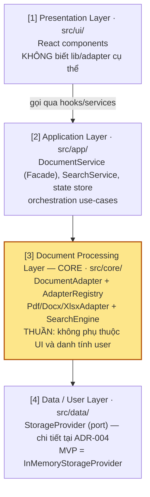
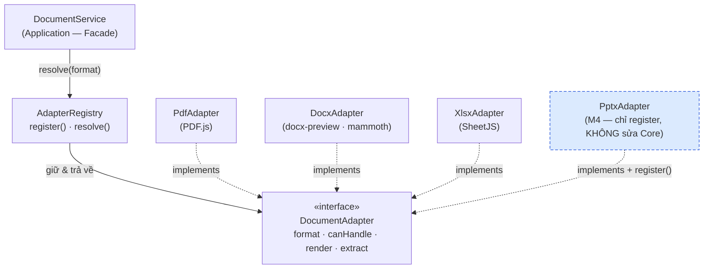

# 🏗️ ADR-003 — Layered Architecture + Format-Adapter / Registry

## Mục lục

1. [Context](#1-context)
2. [Decision](#2-decision)
   - [2.1. Kiến trúc 4 lớp & Dependency Rule](#21-kiến-trúc-4-lớp--dependency-rule)
   - [2.2. Pattern DocumentAdapter + AdapterRegistry](#22-pattern-documentadapter--adapterregistry)
   - [2.3. Canonical Contracts (verbatim)](#23-canonical-contracts-verbatim)
3. [Status](#3-status)
4. [Consequences](#4-consequences)
   - [4.1. Pros](#41-pros)
   - [4.2. Cons](#42-cons)
   - [4.3. Trade-offs](#43-trade-offs)
5. [Alternatives considered](#5-alternatives-considered)
6. [Tài liệu tham khảo](#6-tài-liệu-tham-khảo)

---

## 1. Context

DocsViewer ở MVP (M1) phải xử lý đúng **3 định dạng lõi**: `.docx`, `.xlsx`, PDF (xem [SRS §1.3](../../020-Requirements/SRS-DocsViewer.md)). Tuy nhiên, Roadmap đặt ra hai áp lực mở rộng đã biết trước, không phải giả định:

- **M4 — thêm định dạng mới** (vd `.pptx`): theo **KR3.2** ([OKRs §3](../../010-Planning/OKRs.md)), việc bổ sung 1 định dạng **không được** đòi hỏi sửa core viewer — và yêu cầu này sẽ được **kiểm chứng ở M4**.
- **M3 — multi-user / multi-tenant**: theo **KR3.1**, logic parse/extract phải **tách rời** khỏi tầng UI và tầng danh tính người dùng, đặt nền cho việc gắn auth/multi-tenant về sau mà không phải viết lại core (liên quan **R-03** trong [Risk Register](../../010-Planning/Risk-Register.md)).

Cả hai áp lực này được hợp nhất thành **FR-11 — Layered Document Processing** ([SRS §3](../../020-Requirements/SRS-DocsViewer.md)) và yêu cầu chất lượng **NFR-06 — Extensibility / Scalability** ([NFR §2](../../020-Requirements/NFR-DocsViewer.md)). Glossary đã định danh hai khái niệm trung tâm: **Document Processing Layer** (tầng logic parse/extract tách rời UI và user) và **Extension Point** (điểm móc để thêm định dạng/auth mà không sửa core) ([Glossary §4](../../999-Resources/Glossary.md)).

Vấn đề kiến trúc cần giải quyết: **làm sao tổ chức code sao cho thêm một định dạng = một thao tác cộng (add), tuyệt đối không phải sửa (modify) core?** Đây chính là Open/Closed Principle áp dụng ở mức module. Đồng thời, ràng buộc bao trùm là **NFR-09 (KISS/YAGNI)** và bandwidth solo dev (**R-07**): giải pháp phải đủ linh hoạt cho M3/M4 nhưng **không** được over-engineering ngay ở M1.

> [!NOTE]
> Quyết định "client-side, không backend ở MVP" được chốt riêng tại [ADR-002](./ADR-002-Client-Side-Processing.md); việc tách lớp dữ liệu người dùng & `StorageProvider` port (**KR3.3**) được chốt riêng tại [ADR-004](./ADR-004-Data-Layer-Separation.md). ADR này tập trung vào **kiến trúc tách lớp** và **cơ chế cắm thêm định dạng** (KR3.1 phần Core-tách-UI/user, và KR3.2).

---

## 2. Decision

Áp dụng **kiến trúc Layered 4 lớp** với **dependency rule một chiều**, và đặt **Document Processing Layer (Core)** ở trung tâm theo pattern **DocumentAdapter + AdapterRegistry**. Hệ quả thiết kế: **thêm một định dạng = viết một adapter mới + gọi `registry.register()`, không chạm vào Core.**

### 2.1. Kiến trúc 4 lớp & Dependency Rule



**Dependency rule (1 chiều):** `Presentation → Application → Core → Data`. Mũi tên phụ thuộc chỉ đi xuống; **không có chiều ngược lại**. Cụ thể:

- **Core KHÔNG phụ thuộc Presentation** và **KHÔNG biết danh tính user** → thỏa **KR3.1** (logic xử lý tài liệu tách rời UI và tầng người dùng).
- **Presentation chỉ nói chuyện với Application** qua hooks/services, không gọi thẳng lib document hay adapter cụ thể → giữ UI ổn định khi đổi lib (liên quan **R-01/R-06**).
- **Application điều phối use-case** (validate → detect → render → extract) qua Facade `DocumentService`, không tự parse.
- **Data Layer** là điểm móc cho persistence/auth ở M3 — đặc tả riêng tại [ADR-004](./ADR-004-Data-Layer-Separation.md) (**KR3.3**), không lặp lại ở đây.

Quy tắc một chiều này là điều **đảm bảo** tính tách lớp không bị xói mòn theo thời gian: vì Core không "nhìn thấy" lớp trên, mọi thay đổi UI/user không thể rò rỉ ngược vào Core, và Core có thể được test/tái sử dụng độc lập (testability — phục vụ QA Phase 5).

> [!NOTE]
> **Shared Kernel `src/domain/`.** Các Domain Entity và config nền (`DocumentSession`, `FileFormat`, `MAX_FILE_SIZE`...) được tách thành một **Shared Kernel** thuần (pure types/enums, không behavior) ở `src/domain/` — vòng trong cùng mà cả 4 lớp phụ thuộc *hướng vào*. Đây **không** phải lớp xử lý thứ 5: mô hình 4 lớp ở trên vẫn nguyên vẹn. Lý do bắt buộc: port `StorageProvider` ở lớp Data tham chiếu `DocumentSession`, nên nếu để entity trong Core sẽ tạo back-edge Data → Core. Chi tiết source tree tại [SDD §4 — Project Structure](./SDD-DocsViewer.md#4-project-structure-source-tree).

### 2.2. Pattern DocumentAdapter + AdapterRegistry

Trong Core, mỗi định dạng được đóng gói thành một **DocumentAdapter** triển khai cùng một interface (`canHandle` / `render` / `extract`). Một **AdapterRegistry** giữ danh sách adapter đã đăng ký và `resolve()` adapter đúng theo `FileFormat`. `DocumentService` (Application) chỉ làm việc với interface `DocumentAdapter` trừu tượng — **không** biết tới `PdfAdapter`, `DocxAdapter` hay `XlsxAdapter` cụ thể.



Luồng "thêm `.pptx` ở M4": viết `PptxAdapter implements DocumentAdapter`, thêm giá trị enum `FileFormat`, rồi `registry.register(new PptxAdapter())`. `AdapterRegistry`, `DocumentService` và toàn bộ Presentation **không đổi một dòng** → đây chính là cách kiến trúc **thoả KR3.2** một cách kiểm chứng được ở M4. Đây là biểu hiện trực tiếp của **Open/Closed Principle** (mở để mở rộng, đóng để sửa đổi).

### 2.3. Canonical Contracts (verbatim)

Hai interface dưới đây là **canonical contract của Core** (trích nguyên văn từ SSOT Phase 2; chi tiết đầy đủ các kiểu dữ liệu liên quan và contract `DocumentService` nằm tại [Spec-Module-Contracts](../API/Spec-Module-Contracts.md) — không lặp lại ở đây):

```typescript
// CORE — pluggable adapter (FR-11, KR3.2)
interface DocumentAdapter {
  readonly format: FileFormat;
  canHandle(file: File): boolean;                 // extension/MIME (FR-05.2)
  render(file: File): Promise<RenderedDocument>;  // FR-02/03/04
  extract(file: File): Promise<ExtractedContent>; // FR-06/07
}

interface AdapterRegistry {
  register(adapter: DocumentAdapter): void;       // thêm format không sửa core (KR3.2)
  resolve(format: FileFormat): DocumentAdapter | undefined;
}
```

`DocumentService` (Facade ở Application Layer) là **consumer** duy nhất của `AdapterRegistry`: nó gọi `resolve(format)` để lấy adapter rồi uỷ quyền `render`/`extract`. Việc này giữ ranh giới sạch giữa orchestration (Application) và xử lý định dạng (Core).

---

## 3. Status

**Accepted.** Security Auditor đã review (gate bắt buộc Phase 2 — [Spec-Security §7](../Security/Spec-Security-DocsViewer.md#7-security-auditor-review)) và được trisjr (Accountable) phê duyệt cùng bộ ADR-001..ADR-004 + SDD ngày 2026-06-25; sẵn sàng vào Phase 3 (implementation).

---

## 4. Consequences

### 4.1. Pros

- **Extensibility kiểm chứng được (NFR-06, KR3.2):** thêm định dạng = add adapter + `register()`, không sửa Core; M4 có tiêu chí nghiệm thu rõ ràng.
- **Core tách UI/user (KR3.1):** Core thuần, không phụ thuộc Presentation hay danh tính user; sẵn sàng cho multi-user M3 mà không phải viết lại core.
- **Maintainability & testability (NFR-09):** ranh giới module rõ; Core có thể unit-test độc lập, không cần DOM/UI — tạo feedback loop nhanh cho QA Phase 5.
- **Cô lập rủi ro lib (R-01/R-06):** mỗi lib document bị "nhốt" trong một adapter; thay/nâng cấp lib (vd đổi engine render `.docx`) chỉ tác động một adapter, không lan ra UI hay các định dạng khác.
- **Đồng nhất hành vi (FR-05):** mọi định dạng đi qua cùng interface `DocumentAdapter` → Unified Viewer xử lý nhất quán cho cả 3 định dạng.

### 4.2. Cons

- **Thêm một tầng gián tiếp (indirection):** lập trình viên phải đi qua `Registry → DocumentAdapter` thay vì gọi thẳng lib — chi phí đọc/hiểu cao hơn một chút so với code thẳng.
- **Boilerplate ban đầu:** cần định nghĩa interface, registry, và scaffold ba adapter ngay ở M1 dù MVP chỉ có 3 định dạng.
- **Kỷ luật dependency rule:** lợi ích chỉ giữ được nếu quy tắc một chiều được tuân thủ nghiêm; cần guardrail (lint/review) để Core không vô tình import ngược lên Application/Presentation.

### 4.3. Trade-offs

Đây là sự đánh đổi cốt lõi **indirection vs extensibility**: chấp nhận **chi phí gián tiếp + boilerplate nhỏ ngay từ M1** để **mua khả năng mở rộng có kiểm chứng (KR3.2) và tách lớp (KR3.1)** mà M3/M4 đã được Roadmap cam kết. Vì hai milestone mở rộng này là **đã biết trước, không phải "phòng xa"**, mức trừu tượng tối thiểu (một interface + một registry) không vi phạm YAGNI (**NFR-09**) — nó là phản hồi trực tiếp cho FR-11. Đồng thời, chúng ta cố ý **dừng ở mức tối thiểu**: không build plugin framework (xem §5), giữ phù hợp bandwidth solo dev (**R-07**).

---

## 5. Alternatives considered

### Alt A — Monolithic switch-by-format (REJECTED)

Một module trung tâm dùng `switch (format)` (hoặc chuỗi `if/else`) để chọn nhánh xử lý PDF/`.docx`/`.xlsx` ngay trong Core.

- **Why rejected:** mỗi lần thêm định dạng phải **sửa** chính khối `switch` trong Core — vi phạm trực tiếp **KR3.2** ("thêm định dạng không sửa core") và Open/Closed Principle. Khối switch phình to theo thời gian, trộn lẫn logic các định dạng, khó test cô lập và dễ gây regression chéo (sửa nhánh PDF làm hỏng nhánh `.xlsx`). Đây là đúng cái mà FR-11 muốn loại bỏ.

### Alt B — Plugin micro-framework (REJECTED)

Xây một hệ plugin đầy đủ: dynamic discovery, manifest, sandbox/isolation, lifecycle hooks, dependency injection container cho adapter.

- **Why rejected:** **over-engineering / YAGNI** so với nhu cầu MVP và Roadmap (**NFR-09**). MVP chỉ có 3 định dạng và M4 thêm đúng 1 định dạng nội bộ — một `AdapterRegistry` đơn giản với `register()`/`resolve()` đã thoả trọn KR3.2 mà không cần cơ chế nạp động phức tạp. Chi phí xây/bảo trì framework vượt xa lợi ích, lại tăng tải cho solo dev (**R-07**). Pattern Adapter + Registry (§2.2) là điểm cân bằng đúng giữa hai cực Alt A (quá cứng) và Alt B (quá nặng).

---

## 6. Tài liệu tham khảo

- [SRS — DocsViewer](../../020-Requirements/SRS-DocsViewer.md) — FR-11, FR-05
- [NFR — DocsViewer](../../020-Requirements/NFR-DocsViewer.md) — NFR-06, NFR-09
- [OKRs — DocsViewer](../../010-Planning/OKRs.md) — KR3.1, KR3.2, KR3.3
- [Risk Register — DocsViewer](../../010-Planning/Risk-Register.md) — R-01, R-03, R-06, R-07
- [Glossary — DocsViewer](../../999-Resources/Glossary.md) — Document Processing Layer, Extension Point
- [ADR-002 — Client-Side Processing](./ADR-002-Client-Side-Processing.md)
- [ADR-004 — Data Layer Separation](./ADR-004-Data-Layer-Separation.md) — KR3.3 / StorageProvider port
- [Spec-Module-Contracts](../API/Spec-Module-Contracts.md) — canonical contracts đầy đủ

---
*Generated by TNMCORE-OS Architect Role.*
