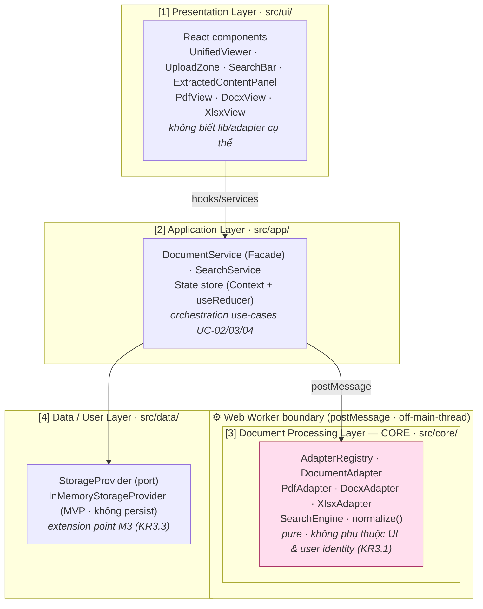

# 🏗️ SDD — DocsViewer (System Design Document)

## Mục lục

1. [Overview](#1-overview)
2. [Architecture Diagram](#2-architecture-diagram)
3. [Component Design](#3-component-design)
4. [Project Structure (Source Tree)](#4-project-structure-source-tree)
5. [Data Model](#5-data-model)
6. [Module Contracts](#6-module-contracts)
7. [Search Strategy](#7-search-strategy)
8. [Resource Limits & MAX_FILE_SIZE](#8-resource-limits--max_file_size)
9. [Performance & Concurrency](#9-performance--concurrency)
10. [Extensibility](#10-extensibility)
11. [Deployment](#11-deployment)
12. [Security Summary](#12-security-summary)
13. [Traceability](#13-traceability)
14. [Tài liệu tham khảo](#tài-liệu-tham-khảo)

---

## 1. Overview

DocsViewer là một **web app client-side SPA**: toàn bộ pipeline parse → render → extract → search chạy **trong browser**, **không có backend / không có DB ở MVP (M1)**. Sản phẩm là self-contained, tối thiểu hóa phụ thuộc mạng (SRS §2.1, §4.3), deploy trên static free-tier (Charter §7.2).

Giá trị cốt lõi (PRD §1): *"Xem mọi tài liệu ở một nơi + biến tài liệu thành dữ liệu khai thác được (feed AI/search)."* MVP khoá cứng 3 **Core Formats** — PDF, `.docx`, `.xlsx` (Glossary §1) — ở hai năng lực: **View đa định dạng** (FR-02/03/04/05) ở mức Acceptable Fidelity (định nghĩa tại NFR-02) và **Extract + In-Document Search** (FR-06/07/08/09/10).

Phạm vi kiến trúc đặt nền (enabler **FR-11**) cho việc thêm định dạng mới và gắn auth/multi-tenant về sau **mà không viết lại core** (O3, KR3.1/3.2/3.3). Auth, storage persistence và multi-tenant **defer M3** (PRD §2.3, §8). Toàn bộ quyết định kiến trúc bám KISS/YAGNI (NFR-09, R-07) và các ADR sau đây:

- **ADR-001-Tech-Stack** — tech stack (TypeScript / React / Vite + PDF.js / docx-preview / mammoth / SheetJS).
- **ADR-002-Client-Side-Processing** — xử lý 100% client-side, không backend MVP.
- **ADR-003-Layered-Adapter-Registry** — kiến trúc 4 lớp + Adapter/Registry cho format extensibility.
- **ADR-004-Data-Layer-Separation** — tách lớp dữ liệu người dùng (`StorageProvider` port).

---

## 2. Architecture Diagram

Kiến trúc **Layered 4 lớp** với **Dependency Rule một chiều**: Presentation → Application → Core → Data. Lớp **Core (Document Processing)** là lớp thuần (pure), **KHÔNG** phụ thuộc Presentation hay user identity (KR3.1, NFR-05), và chạy off-main-thread trong **Web Worker** (NFR-01/07). Application giao tiếp với Core qua ranh giới Worker bằng `postMessage` (async).



> **Dependency rule:** mũi tên chỉ đi xuống. Thêm định dạng = thêm Adapter + `registry.register()` (không sửa Core — KR3.2, ADR-003). Gắn auth/multi-tenant = thay impl `StorageProvider` (không sửa Core — KR3.3, ADR-004).

---

## 3. Component Design

Mỗi lớp tách trách nhiệm theo SOLID (SRP) và Dependency Rule một chiều (ADR-003).

### 3.1. Presentation Layer (`src/ui/`)

React components thuần UI; chỉ gọi Application qua hooks/services, **không** import lib parse/adapter trực tiếp. Styling bằng **Tailwind CSS** (ADR-001); riêng **content area** (vùng render do PDF.js/docx-preview/SheetJS sinh) được cô lập khỏi Tailwind preflight để giữ fidelity (NFR-02).

| Component | Trách nhiệm | FR |
| :-- | :-- | :-- |
| **UnifiedViewer** | Khung giao diện chung; nhận diện loại tài liệu đang xem & route tới view con phù hợp; điều hướng nhất quán mở/đóng/chuyển tài liệu (Glossary "Unified Viewer"). | FR-05 |
| **UploadZone** | Chọn/kéo-thả file; kích hoạt validate (định dạng + size); hiển thị thông báo lỗi thân thiện. | FR-01 |
| **PdfView** | Render canvas PDF; phân trang & zoom cơ bản (UC-02 A1). | FR-02 |
| **DocxView** | Hiển thị HTML container đã render của `.docx` (text/heading/bảng/hình). | FR-03 |
| **XlsxView** | Hiển thị sheet dạng grid; tab chuyển sheet (UC-02 A1). | FR-04 |
| **SearchBar** | Ô nhập keyword; hiển thị tổng số kết quả; nút next/prev. | FR-09, FR-10 |
| **ExtractedContentPanel** | Hiển thị nội dung đã trích xuất; nút Copy/Export; thông báo trạng thái `Empty`/`Failed` (UC-03 E1/E2). | FR-06, FR-07, FR-08 |

### 3.2. Application Layer (`src/app/`)

Orchestration use-case; tách UI ↔ Core (Facade pattern).

| Module | Trách nhiệm | UC |
| :-- | :-- | :-- |
| **DocumentService** (Facade) | Điều phối luồng `open`: validate → detect format → resolve adapter → render → extract; cung cấp `getRendered`/`getExtracted`/`copyExtracted`/`exportExtracted`. Tách Presentation khỏi Core. | UC-02, UC-03 |
| **SearchService** | Bọc `SearchEngine` cho UI: build index từ `ExtractedContent`, chạy search, điều hướng next/prev wrap-around; xử lý edge (query rỗng, chưa extract xong). | UC-04 |
| **State store** | React built-in (Context + useReducer) giữ session state hiện tại — KISS, không Redux (ADR-001). | — |

### 3.3. Document Processing Layer — CORE (`src/core/`)

Lớp **pure**, không phụ thuộc UI/user identity (KR3.1); chạy trong Web Worker.

| Module | Trách nhiệm | Pattern |
| :-- | :-- | :-- |
| **AdapterRegistry** | Đăng ký & resolve `DocumentAdapter` theo `FileFormat`; cho phép thêm format không sửa core (KR3.2). | Registry |
| **DocumentAdapter** (interface) | Hợp đồng chung: `canHandle` / `render` / `extract` per format. | Adapter + Strategy |
| **PdfAdapter** | Render canvas + extract text qua PDF.js (`page.getTextContent()`). | Adapter |
| **DocxAdapter** | Render HTML qua docx-preview; extract raw text qua mammoth (tách render vs extract). | Adapter |
| **XlsxAdapter** | Parse + render grid + extract tabular qua SheetJS. | Adapter |
| **SearchEngine** | Build in-memory index, search substring trên normalized text, next/prev wrap-around; `normalize()` (xem §7). | Strategy |

### 3.4. Data / User Layer (`src/data/`)

| Module | Trách nhiệm | Note |
| :-- | :-- | :-- |
| **StorageProvider** (port) | Cổng trừu tượng `save`/`load`/`clear` cho session — extension point M3 (KR3.3, ADR-004). | Ports & Adapters |
| **InMemoryStorageProvider** | Impl MVP: giữ session trong RAM, **không persist**; clear khi hết session (privacy by design — R-03, NFR-05). | MVP |

---

## 4. Project Structure (Source Tree)

Mục này cụ thể hóa §3 (Component Design) thành **cây thư mục mã nguồn** sẽ dùng ở Phase 4 (Implementation) — chốt vị trí từng module/file để Engineer scaffold không phải đoán. Cấu trúc tuân thủ tuyệt đối **Dependency Rule một chiều** (ADR-003) và **Data-Layer Separation** (ADR-004).

```text
src/
├── main.tsx                    # Composition root: register adapters + inject StorageProvider, mount React
├── domain/                     # ⭐ SHARED KERNEL — pure types/enums, KHÔNG import từ lớp nào
│   ├── FileFormat.ts           #   enum FileFormat
│   ├── limits.ts               #   MAX_FILE_SIZE: Record<FileFormat, number>
│   ├── DocumentSession.ts
│   ├── RenderedDocument.ts     #   + RenderedPage, RenderedSheet
│   ├── ExtractedContent.ts     #   + TextBlock, SheetData
│   └── search.ts               #   SearchIndex, NormalizedSegment, SearchMatch, SearchResultSet
├── ui/                         # [1] Presentation Layer
│   ├── UnifiedViewer.tsx
│   ├── UploadZone.tsx
│   ├── SearchBar.tsx
│   ├── ExtractedContentPanel.tsx
│   ├── ErrorBanner.tsx
│   └── views/
│       ├── PdfView.tsx
│       ├── DocxView.tsx
│       └── XlsxView.tsx
├── app/                        # [2] Application Layer
│   ├── DocumentService.ts      #   Facade (orchestration UC-02/03)
│   ├── SearchService.ts        #   bọc SearchEngine (UC-04)
│   ├── validation.ts           #   UploadValidationResult, UploadError
│   └── state/
│       ├── store.tsx           #   Context + useReducer
│       └── reducer.ts
├── core/                       # [3] Document Processing Layer — pure logic
│   ├── adapters/
│   │   ├── DocumentAdapter.ts  #   interface (hợp đồng pluggable)
│   │   ├── AdapterRegistry.ts
│   │   ├── PdfAdapter.ts
│   │   ├── DocxAdapter.ts
│   │   └── XlsxAdapter.ts
│   ├── search/
│   │   ├── SearchEngine.ts
│   │   └── normalize.ts
│   └── worker.ts               #   Web Worker entry (postMessage boundary)
└── data/                       # [4] Data / User Layer
    ├── StorageProvider.ts      #   port (interface)
    └── InMemoryStorageProvider.ts   # impl MVP — no persist

test/                           # mirror cấu trúc src/ (Vitest + RTL)
```

> [!IMPORTANT]
> **Shared Kernel (`src/domain/`) — quyết định kiến trúc cần nắm.** Các Domain Entity (`DocumentSession`...) và config nền (`FileFormat`, `MAX_FILE_SIZE`) được **cả 4 lớp** tham chiếu: Core *tạo ra*, Application *điều phối*, Presentation *hiển thị*, Data *lưu trữ*. Đặc biệt port `StorageProvider.save(session: DocumentSession)` ở lớp Data (lớp dưới cùng) buộc phải biết `DocumentSession` — nếu type này nằm trong `core/` sẽ tạo **back-edge Data → Core**, phá vỡ Dependency Rule một chiều của ADR-003/004.
>
> Vì vậy domain types/enums được tách thành **Shared Kernel** ở `src/domain/`: **vòng trong cùng (innermost ring)**, không phụ thuộc lớp nào; mọi lớp phụ thuộc *hướng vào* nó (chuẩn Clean Architecture "entities at the center"). Đây là pure types **không có behavior**, nên **không** phải lớp xử lý thứ 5 — mô hình 4 lớp của ADR-003 vẫn nguyên vẹn. Hệ quả ràng buộc: `FileFormat` (bị `DocumentSession.format` reference) **bắt buộc** nằm trong kernel, `MAX_FILE_SIZE` (keyed theo `FileFormat`) theo cùng; còn `UploadValidationResult` chỉ App/Presentation dùng nên ở lại `app/`.

| Thư mục | Vai trò | Phụ thuộc (import hướng) |
| :-- | :-- | :-- |
| `src/domain/` | Shared Kernel — Domain Data Model + config thuần (canonical tại [DB-Entity-DocsViewer](../Schema/DB-Entity-DocsViewer.md)) | **Không import gì** (innermost) |
| `src/ui/` | [1] Presentation — React components (§3.1) | → `app/`, → `domain/` (type-only) |
| `src/app/` | [2] Application — Facade, orchestration, state (§3.2) | → `core/`, → `data/` (port), → `domain/` |
| `src/core/` | [3] Document Processing — adapters, search; **pure** (§3.3) | → `domain/` (chỉ kernel) |
| `src/data/` | [4] Data / User — `StorageProvider` port + impl (§3.4) | → `domain/` (cho `DocumentSession`) |

> **Hướng phụ thuộc tổng thể:** mọi lớp → `domain/` (inward) · `ui → app → core` · `app → data` (qua port). **Core thuần, không chạm storage** — `StorageProvider` được inject từ composition root (`main.tsx`), khớp diagram ở §2 và [ADR-004 §2.3](./ADR-004-Data-Layer-Separation.md).

> [!NOTE]
> **Worker boundary KHÔNG bao trùm toàn bộ `core/`.** Phần lớn xử lý nặng chạy off-main-thread qua `core/worker.ts`, **nhưng `DocxAdapter.render`** (docx-preview) **bắt buộc chạy main thread** vì cần `document` để dựng DOM (xem [Spec-Integration-OSS-Libraries §7](../API/Spec-Integration-OSS-Libraries.md)). Đây là ngoại lệ có chủ đích, không phải vi phạm kiến trúc.

---

## 5. Data Model

Đây là **Domain Data Model in-memory / runtime** — **KHÔNG phải DB persistence ở MVP** (theo ADR-002 client-side, không backend). Các entity được reserve cho persistence ở M3.

Tóm tắt entity (chi tiết field + `erDiagram` quan hệ tại file Schema):

- **DocumentSession** — một tài liệu đang mở trong session (`id`, `fileName`, `format`, `fileSize`, `status`, `createdAt`).
- **RenderedDocument** — payload render theo format (PDF pages / DOCX htmlContainer / XLSX sheets grid) — FR-02/03/04.
- **ExtractedContent** — `textBlocks` (PDF/DOCX) + `tabularData` (XLSX) + `status` (`Pending`/`Ready`/`Empty`/`Failed`, `Empty` cho PDF scan — UC-03 E1) — FR-06/07.
- **SearchIndex** — `segments: NormalizedSegment[]` (originalText/normalizedText/ref) — §7.
- **SearchMatch** / **SearchResultSet** — kết quả + `activeIndex` cho wrap-around (BR-006-5) — FR-10.
- **Config** — `FileFormat` enum, `MAX_FILE_SIZE: Record<FileFormat, number>` (§8).

> Quan hệ: DocumentSession 1—1 RenderedDocument · DocumentSession 1—1 ExtractedContent · ExtractedContent 1—1 SearchIndex · SearchIndex 1—{ SearchMatch (theo query).
>
> 📐 ER Diagram + chi tiết field: [DB-Entity-DocsViewer](../Schema/DB-Entity-DocsViewer.md).

---

## 6. Module Contracts

Các "API Spec" của DocsViewer là **Module Contracts nội bộ (TypeScript interfaces)** — không có REST API ở MVP (ADR-002). Tóm tắt:

- **`FileFormat`** enum + **`UploadValidationResult`** / **`UploadError`** — kết quả validate upload (FR-01).
- **`DocumentAdapter`** + **`AdapterRegistry`** (CORE) — hợp đồng pluggable adapter & registry (FR-11, KR3.2 → UC-02).
- **`DocumentService`** (APPLICATION Facade) — `open`/`getRendered`/`getExtracted`/`copyExtracted`/`exportExtracted` (FR-05/08 → UC-02, UC-03).
- **`SearchEngine`** + **`normalize()`** (CORE) — `buildIndex`/`search`/`next`/`prev` (FR-09/10, BR-006-4/5 → UC-04).
- **`StorageProvider`** (DATA port) — `save`/`load`/`clear`; impl MVP `InMemoryStorageProvider` (FR-11.3 extension point, KR3.3).

> 📄 Full TypeScript interface signatures + Contract → Use Case mapping: [Spec-Module-Contracts](../API/Spec-Module-Contracts.md).
> 📦 License & integration của các OSS library (PDF.js/docx-preview/mammoth/SheetJS): [Spec-Integration-OSS-Libraries](../API/Spec-Integration-OSS-Libraries.md) (R-06).

---

## 7. Search Strategy

In-Document Search (FR-09/10, BRD-006) chạy hoàn toàn in-memory trên `ExtractedContent` của **tài liệu đang xem** (single-document — BR-006-1):

- **Normalization** — `normalize(input)` = `input.normalize('NFD').replace(/[̀-ͯ]/g, '').toLowerCase().replace(/đ/g, 'd')`. Bước cuối thay `đ→d` vì `đ/Đ` (U+0111/U+0110) **không** decompose dưới NFD. Kết quả: matching **không phân biệt dấu** (gõ "bao cao" khớp "Báo Cáo", "da nang" khớp "Đà Nẵng") + **không phân biệt hoa/thường** (BR-006-4).
- **Matching** — **substring** trên normalized text (BR-006-4); trả về list `SearchMatch` + total + highlight (FR-10.1).
- **Navigation** — next/prev **wrap-around**: tại kết quả cuối → vòng về đầu, ngược lại (BR-006-5, FR-10.2, UC-04 A1).
- **Edge cases** — query rỗng → no-op (UC-04 E2); `ExtractedContent` chưa `Ready` hoặc `Empty` → báo không thể search (UC-04 E3).
- **Phụ thuộc** — chất lượng search lệ thuộc trực tiếp độ chính xác extraction (BR-006-3, NFR-03, R-02). Custom in-memory, không dùng lib (KISS — ADR-001).

---

## 8. Resource Limits & MAX_FILE_SIZE

Đây là **quyết định cuối của Architect** — NFR §4.1 ủy quyền giá trị cho Phase-2. Chốt cho MVP (FR-01.2, NFR-07, UC-02 E2):

| Định dạng | `MAX_FILE_SIZE` |
| :-- | :-- |
| PDF | **25 MB** |
| `.docx` | **25 MB** |
| `.xlsx` | **15 MB** |

**Why (rationale):** parse client-side tạo nhiều bản sao in-memory (ArrayBuffer gốc + parsed DOM/objects ≈ 3–5× kích thước file). Với ngưỡng 25 MB → peak bộ nhớ ≈ 100–125 MB, chấp nhận được trên trình duyệt hiện đại (NFR-08). `.xlsx` đặt thấp hơn (15 MB) vì SheetJS bung cell-objects tốn bộ nhớ hơn DOM của `.docx`/`.pdf`. Các giá trị này **tunable** sau khi đo perf thực tế (NFR-07, R-05). File vượt ngưỡng → reject với thông báo nêu rõ giới hạn (FR-01.2, UC-02 E2). Fold trực tiếp vào SDD, không tạo ADR riêng (KISS — NFR-09).

---

## 9. Performance & Concurrency

- **Web Workers** — toàn bộ heavy parsing (PDF.js, SheetJS, docx-preview/mammoth) chạy off-main-thread trong Worker (ranh giới ở §2), giữ main thread luôn responsive → đạt thời gian mở trang đầu mục tiêu **NFR-01** và tôn trọng giới hạn bộ nhớ **NFR-07**. PDF.js vốn có worker riêng (ADR-001).
- **Lazy / progressive render** — chỉ render trang/sheet trong viewport, nạp dần khi user điều hướng (phân trang PDF, lazy sheet `.xlsx`) → tránh dựng toàn bộ tài liệu lớn cùng lúc (NFR-07, R-05). File lớn hơn baseline (NFR §4.2) được quản lý bằng lazy render mà vẫn không vi phạm NFR-01 trên fixture baseline.
- **MAX_FILE_SIZE pre-check** (§8) chặn input vượt ngưỡng trước khi parse → bảo vệ bộ nhớ (NFR-07).

---

## 10. Extensibility

Hiện thực hoá enabler **FR-11** / NFR-06, đo bằng KR3.x:

- **Thêm định dạng mới (FR-11.2, KR3.2)** — viết một `DocumentAdapter` mới (vd `PptxAdapter`) implement `canHandle`/`render`/`extract`, rồi `registry.register(adapter)`. **Không sửa Core**, không sửa Application/Presentation (kiểm chứng ở M4 — ADR-003).
- **Auth / multi-tenant (FR-11.3, KR3.3)** — thay impl `StorageProvider` (vd `ServerStorageProvider` có tenant scoping) ở Data Layer. Core pure không phụ thuộc user identity (KR3.1) nên **không bị tác động** — extension point dành sẵn cho M3 (ADR-004).
- Layered + Dependency Rule một chiều đảm bảo thay đổi ở Data/Adapter không lan ngược lên Core (NFR-06, ripple-effect contained).

---

## 11. Deployment

- **Static host free-tier** — Vercel / Netlify / GitHub Pages (Charter §7.2 ngân sách cá nhân). Vite 6 build ra static bundle (HTML/JS/CSS), không cần server runtime ở MVP (ADR-002).
- **Không có backend / DB / API server** ở M1; mọi xử lý chạy trên client. CDN tĩnh đủ cho single-user (SRS §4.3).
- Backend/server-side storage chỉ xuất hiện khi kích hoạt `StorageProvider` server impl ở M3 (defer).

---

## 12. Security Summary

Posture MVP: single-user, client-side, **không network upload** → attack surface tối thiểu (NFR-05). Privacy by default — không persist ngoài session (R-03, T5). Các threat trọng yếu cần xử lý ở implementation:

- **XSS qua `.docx` render HTML** (docx-preview render HTML từ doc không tin cậy) — HIGH: sanitize (DOMPurify) + sandbox container + CSP.
- **Zip-bomb / decompression** (`.docx`/`.xlsx` là zip) — MED: `MAX_FILE_SIZE` pre-check (§8) + parse trong Worker.
- **Malicious PDF / PDF.js exploit** — MED: pin & update PDF.js, worker sandbox.
- **Data-layer separation** (ADR-004) + `StorageProvider` port dành sẵn hardening multi-tenant M3 (defer — NFR-05).

> 🔐 Threat model đầy đủ (T1–T6, mitigation, sign-off Security Auditor): [Spec-Security-DocsViewer](../Security/Spec-Security-DocsViewer.md).

---

## 13. Traceability

Ánh xạ requirement → component/decision (số liệu là SSOT tại file requirement — không restate ở đây).

| ID | Component / Decision |
| :-- | :-- |
| FR-01 | `DocumentService.open` + `UploadValidationResult` + `MAX_FILE_SIZE` (§8) · UploadZone |
| FR-02 | `PdfAdapter.render` · PdfView |
| FR-03 | `DocxAdapter.render` · DocxView |
| FR-04 | `XlsxAdapter.render` · XlsxView |
| FR-05 | `DocumentService` + `AdapterRegistry.resolve` · UnifiedViewer |
| FR-06 | `PdfAdapter.extract` + `DocxAdapter.extract` |
| FR-07 | `XlsxAdapter.extract` |
| FR-08 | `DocumentService.copyExtracted` / `exportExtracted` · ExtractedContentPanel |
| FR-09 | `SearchEngine.search` · SearchService · SearchBar |
| FR-10 | `SearchService.next/prev` → `SearchEngine.next/prev` + `SearchResultSet` + highlight · SearchBar |
| FR-11 | Layered + `AdapterRegistry` + `StorageProvider` port (ADR-003-Layered-Adapter-Registry / ADR-004-Data-Layer-Separation) |
| NFR-01 | Web Workers + lazy/progressive render (§9) |
| NFR-02 | Lib choice (ADR-001-Tech-Stack; Acceptable Fidelity định nghĩa tại NFR-02) |
| NFR-03 | mammoth / PDF.js text extract (`*.extract`) |
| NFR-04 | `SearchEngine` + `normalize()` (§7) |
| NFR-05 | ADR-004-Data-Layer-Separation + Security Summary (§12) |
| NFR-06 | ADR-003-Layered-Adapter-Registry + ADR-004-Data-Layer-Separation |
| NFR-07 | `MAX_FILE_SIZE` (§8) + lazy render (§9) |
| NFR-08 | Modern browser target (Web Worker / Canvas support) |
| NFR-09 | KISS/YAGNI + OSS + TypeScript (ADR-001-Tech-Stack) |
| KR1.1 | 3/3 Core Formats view: `PdfAdapter`/`DocxAdapter`/`XlsxAdapter.render` (FR-02/03/04) |
| KR1.2 | Render fidelity: lib choice (ADR-001-Tech-Stack) → NFR-02 |
| KR1.3 | ≤ 3s trang đầu: Web Workers + lazy/progressive render (§9) → NFR-01 |
| KR2.1 | 3/3 formats extract: `*.extract` (FR-06/07) → NFR-03 |
| KR2.2 | Extraction accuracy: mammoth / PDF.js text (§3.3) → NFR-03 |
| KR2.3 | Search precision: `SearchEngine` + `normalize()` (§7) → NFR-04 |
| KR3.1 | ADR-003: Core tách rời UI & user identity |
| KR3.2 | ADR-003: Adapter + Registry — thêm format không sửa core |
| KR3.3 | ADR-004: `StorageProvider` port extension point |
| R-01 | ADR-001-Tech-Stack (lib mạnh) + SDD render design (§3.3) |
| R-02 | Extraction quality (SDD §3.3, §7 · Integration Spec) |
| R-03 | ADR-004-Data-Layer-Separation + Security Summary (§12) |
| R-05 | `MAX_FILE_SIZE` (§8) + lazy render (§9) |
| R-06 | OSS license/maintenance (Spec-Integration-OSS-Libraries) |
| R-07 | KISS/YAGNI toàn cục (NFR-09) |

---

## Tài liệu tham khảo

- [PRD — DocsViewer](../../020-Requirements/PRD-DocsViewer.md)
- [SRS — DocsViewer](../../020-Requirements/SRS-DocsViewer.md)
- [NFR — DocsViewer](../../020-Requirements/NFR-DocsViewer.md)
- [UC-02 — Tải lên & Xem tài liệu](../../020-Requirements/Use-Cases/UC-02-Upload-View-Document.md)
- [UC-03 — Trích xuất & Export nội dung](../../020-Requirements/Use-Cases/UC-03-Extract-Export-Content.md)
- [UC-04 — Tìm kiếm trong tài liệu](../../020-Requirements/Use-Cases/UC-04-Search-In-Document.md)
- [BRD-006 — In-Document Search](../../020-Requirements/BRD/BRD-006-In-Document-Search.md)
- [OKRs — DocsViewer](../../010-Planning/OKRs.md)
- [Risk Register — DocsViewer](../../010-Planning/Risk-Register.md)
- [MVP Scope — DocsViewer](../../010-Planning/MVP-Scope.md)
- [Project Charter — DocsViewer](../../010-Planning/Charter-DocsViewer.md)
- [Glossary — DocsViewer](../../999-Resources/Glossary.md)
- [ADR-001 — Tech Stack](./ADR-001-Tech-Stack.md)
- [ADR-002 — Client-Side Processing](./ADR-002-Client-Side-Processing.md)
- [ADR-003 — Layered + Adapter/Registry](./ADR-003-Layered-Adapter-Registry.md)
- [ADR-004 — Data Layer Separation](./ADR-004-Data-Layer-Separation.md)
- [Spec-Module-Contracts](../API/Spec-Module-Contracts.md)
- [Spec-Integration-OSS-Libraries](../API/Spec-Integration-OSS-Libraries.md)
- [DB-Entity-DocsViewer](../Schema/DB-Entity-DocsViewer.md)
- [Spec-Security-DocsViewer](../Security/Spec-Security-DocsViewer.md)

---
*Generated by TNMCORE-OS Architect Role.*
