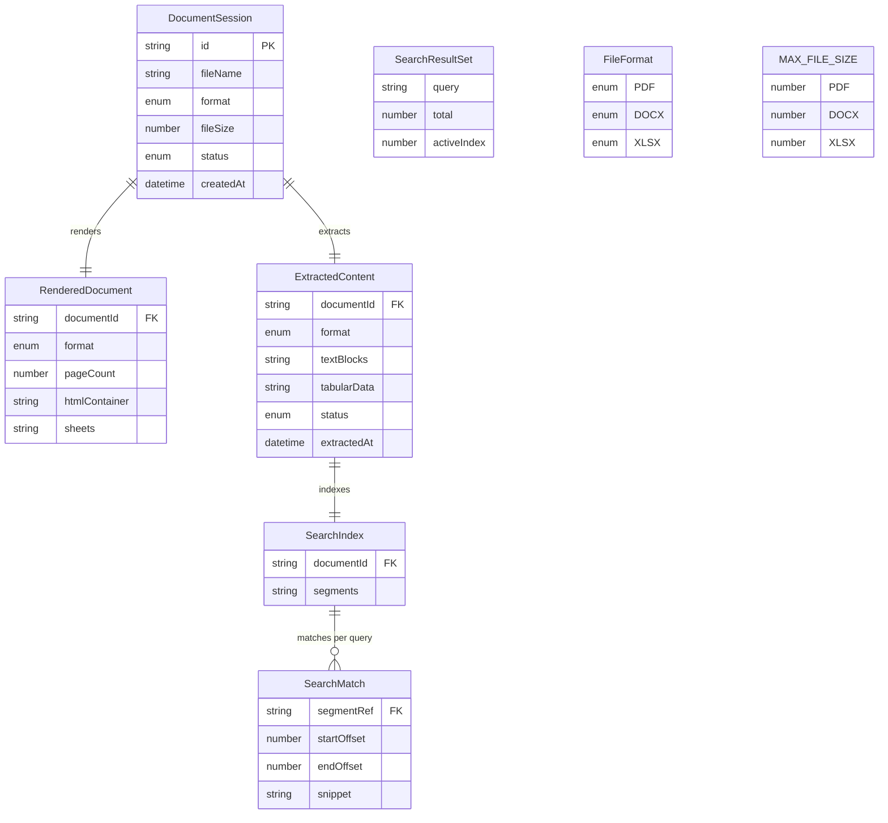

# 🗃️ Domain Data Model — DocsViewer (In-Memory Runtime)

> [!NOTE]
> **MVP KHÔNG có database/persistence; đây là model in-memory runtime.** Toàn bộ entity dưới đây tồn tại trong vòng đời một phiên xem (session) trên browser — không ghi xuống đĩa, không upload server. Persistence (DB) reserved cho **M3** qua port `StorageProvider` (xem `DocumentService`/`StorageProvider` trong [Spec-Module-Contracts](../API/Spec-Module-Contracts.md)). Việc không persist là một quyết định **privacy-by-design** (tham chiếu [NFR-05](../../020-Requirements/NFR-DocsViewer.md)).

## Mục lục

1. [Phạm vi & Nguyên tắc mô hình hóa](#1-phạm-vi--nguyên-tắc-mô-hình-hóa)
2. [Sơ đồ ER (Entity-Relationship)](#2-sơ-đồ-er-entity-relationship)
3. [Entity: DocumentSession](#3-entity-documentsession)
4. [Entity: RenderedDocument](#4-entity-rendereddocument)
5. [Entity: ExtractedContent (+ TextBlock, SheetData)](#5-entity-extractedcontent--textblock-sheetdata)
6. [Entity: SearchIndex (+ NormalizedSegment)](#6-entity-searchindex--normalizedsegment)
7. [Entity: SearchMatch](#7-entity-searchmatch)
8. [Entity: SearchResultSet](#8-entity-searchresultset)
9. [Enum & Config: FileFormat, MAX_FILE_SIZE](#9-enum--config-fileformat-max_file_size)
10. [Traceability](#10-traceability)
11. [Tài liệu tham khảo](#11-tài-liệu-tham-khảo)

---

## 1. Phạm vi & Nguyên tắc mô hình hóa

Tài liệu này đặc tả **Domain Data Model** — các kiểu dữ liệu (runtime objects) mà các module trong [Spec-Module-Contracts](../API/Spec-Module-Contracts.md) trao đổi với nhau. Vì DocsViewer là **client-side SPA không backend/DB ở M1**, "DB Schema" được tái diễn giải thành **mô hình dữ liệu in-memory**: các object sống trong heap của browser trong suốt một phiên xem, và bị giải phóng (garbage-collected / `clear()`) khi phiên kết thúc.

**"Normalized" theo nghĩa single-responsibility:** mỗi entity có **một trách nhiệm duy nhất** và **không duplicate dữ liệu** của entity khác:

- `DocumentSession` giữ **metadata phiên** (danh tính tài liệu, trạng thái vòng đời) — không chứa nội dung render hay text.
- `RenderedDocument` giữ **payload hiển thị** (canvas/HTML/grid) — không lặp lại metadata phiên.
- `ExtractedContent` giữ **text/data đã bóc tách** — không lặp lại payload render.
- `SearchIndex` / `SearchMatch` / `SearchResultSet` là các **dẫn xuất** từ `ExtractedContent`, tham chiếu ngược về nó qua khóa (`documentId`, `ref`) thay vì sao chép nội dung.

Liên kết giữa các entity dùng **`documentId` (= `DocumentSession.id`)** làm khóa định danh logic, và **`ref`** làm con trỏ vị trí (segment/block) — tương tự foreign key trong mô hình quan hệ, nhưng ở đây là tham chiếu in-memory.

> [!IMPORTANT]
> Các kiểu union, `Record<...>`, mảng `[]` ở **field tables** là contract verbatim (đồng bộ với [Spec-Module-Contracts](../API/Spec-Module-Contracts.md)). Sơ đồ `erDiagram` (§2) dùng token type đơn giản hóa (`string`, `number`, `enum`, `datetime`) để Mermaid render đúng — field tables mới là nguồn chính xác về kiểu.

---

## 2. Sơ đồ ER (Entity-Relationship)

> Đây là model **in-memory/runtime**, KHÔNG phải DB persistence ở MVP; cấu trúc quan hệ dưới đây reserved cho M3 khi `StorageProvider` được hiện thực hóa.

**Diễn giải quan hệ (verbatim theo brief §5):**

- `DocumentSession ||--|| RenderedDocument` — mỗi phiên có đúng một payload render (1-1).
- `DocumentSession ||--|| ExtractedContent` — mỗi phiên có đúng một bộ nội dung trích xuất (1-1).
- `ExtractedContent ||--|| SearchIndex` — index được build từ đúng một bộ `ExtractedContent` (1-1).
- `SearchIndex ||--o{ SearchMatch` — một index sinh ra **0..n** `SearchMatch` **theo từng query** (1-nhiều, phụ thuộc keyword người dùng nhập).

`SearchResultSet`, `FileFormat`, `MAX_FILE_SIZE` xuất hiện như **standalone block** (không có quan hệ khóa với nhóm trên): `SearchResultSet` là cấu trúc kết quả (gói nhiều `SearchMatch` theo một query), còn `FileFormat`/`MAX_FILE_SIZE` là enum/config cấp ứng dụng.

---

## 3. Entity: DocumentSession

**Trách nhiệm:** Đại diện cho **một tài liệu đang mở trong session** — giữ metadata định danh & trạng thái vòng đời. Là **aggregate root** của model: mọi entity khác tham chiếu về nó qua `documentId`.

| Field | Type | Mô tả | Ràng buộc |
| :--- | :--- | :--- | :--- |
| `id` | `string` | Định danh duy nhất của phiên/tài liệu (làm khóa logic cho `documentId` ở các entity khác). | Required · unique trong runtime · sinh khi `DocumentService.open` chạy. |
| `fileName` | `string` | Tên file gốc người dùng upload. | Required · non-empty. |
| `format` | `FileFormat` | Định dạng đã nhận diện (extension/MIME — FR-05.2). | Required · ∈ enum `FileFormat`. |
| `fileSize` | `number` | Kích thước file (bytes); dùng đối chiếu `MAX_FILE_SIZE` (FR-01.2). | Required · ≥ 0 · ≤ `MAX_FILE_SIZE[format]`. |
| `status` | `'Loading' \| 'Rendered' \| 'Failed'` | Trạng thái vòng đời phiên. | Required · khởi tạo `'Loading'` → `'Rendered'` (thành công) hoặc `'Failed'` (lỗi/corrupt, FR-01.3). |
| `createdAt` | `Date` | Thời điểm phiên được tạo. | Required. |

> Liên quan: được tạo & trả về bởi `DocumentService.open(file)` (xem [Spec-Module-Contracts](../API/Spec-Module-Contracts.md), UC-02). Là input của `StorageProvider.save/load` ở M3 — đây là extension point persistence.

---

## 4. Entity: RenderedDocument

**Trách nhiệm:** Giữ **payload phục vụ hiển thị** (View) theo từng định dạng. Tách rời khỏi `ExtractedContent` để render (FR-02/03/04) và extract (FR-06/07) là hai concern độc lập (Strategy theo format). Payload mang tính **format-specific** (union theo `format`).

| Field | Type | Mô tả | Ràng buộc |
| :--- | :--- | :--- | :--- |
| `documentId` | `string` | Tham chiếu về `DocumentSession.id` (khóa liên kết). | Required · = một `DocumentSession.id` đang tồn tại. |
| `format` | `FileFormat` | Định dạng của payload (quyết định nhánh field nào hiện diện). | Required · ∈ enum `FileFormat`. |
| `pageCount` | `number` | Số trang (chỉ PDF — FR-02.1 page navigation). | Optional · hiện diện khi `format = PDF` · ≥ 1. |
| `pages` | `RenderedPage[]` | Danh sách trang render (canvas/bitmap mỗi trang — PDF; hỗ trợ zoom FR-02.2 & lazy render NFR-07). | Optional · hiện diện khi `format = PDF`. |
| `htmlContainer` | `HTMLElement \| string` | Khối HTML đã render của `.docx` (FR-03 — text/heading/bảng/hình ở Acceptable Fidelity, NFR-02). | Optional · hiện diện khi `format = DOCX` · HTML phải được sanitize trước khi mount (xem T1, [Spec-Security](../Security/Spec-Security-DocsViewer.md)). |
| `sheets` | `RenderedSheet[]` | Mảng sheet dạng grid của `.xlsx` (FR-04.1 — giá trị ô + chuyển sheet; công thức hiển thị kết quả FR-04.2). | Optional · hiện diện khi `format = XLSX` · ≥ 1 sheet. |

> Payload theo format là **mutually exclusive**: đúng một trong `{pages+pageCount}` / `{htmlContainer}` / `{sheets}` được điền theo `format`. Trả về bởi `DocumentAdapter.render` và truy xuất qua `DocumentService.getRendered(sessionId)`.

---

## 5. Entity: ExtractedContent (+ TextBlock, SheetData)

**Trách nhiệm:** Giữ **nội dung đã bóc tách** (text cho PDF/`.docx`, tabular cho `.xlsx`) phục vụ copy/export (FR-08) và search (FR-09/10). Là **nguồn dữ liệu duy nhất** mà `SearchEngine` build index từ đó (không search trực tiếp trên payload render).

### 5.1. ExtractedContent

| Field | Type | Mô tả | Ràng buộc |
| :--- | :--- | :--- | :--- |
| `documentId` | `string` | Tham chiếu về `DocumentSession.id`. | Required · = một `DocumentSession.id` đang tồn tại. |
| `format` | `FileFormat` | Định dạng nguồn (quyết định dùng `textBlocks` hay `tabularData`). | Required · ∈ enum `FileFormat`. |
| `textBlocks` | `TextBlock[]` | Các khối text trích từ PDF/`.docx` (FR-06 — đoạn văn, heading, text trong bảng). | Optional · hiện diện khi `format ∈ {PDF, DOCX}`. |
| `tabularData` | `SheetData[]` | Data dạng bảng trích từ `.xlsx` theo từng sheet (FR-07.1 — giá trị ô theo hàng/cột). | Optional · hiện diện khi `format = XLSX`. |
| `status` | `'Pending' \| 'Ready' \| 'Empty' \| 'Failed'` | Trạng thái trích xuất. | Required · `'Empty'` cho PDF scan không có text layer (UC-03 E1); `'Failed'` khi parse lỗi (UC-03 E3). |
| `extractedAt` | `Date` | Thời điểm hoàn tất trích xuất. | Optional · điền khi `status = 'Ready'`. |

> Search chỉ khả dụng khi `status = 'Ready'`; nếu `'Pending'`/`'Empty'`/`'Failed'` → UI báo không thể search (UC-04 E3).

### 5.2. TextBlock (giá trị thành phần của `textBlocks`)

| Field | Type | Mô tả | Ràng buộc |
| :--- | :--- | :--- | :--- |
| `ref` | `string` | Con trỏ vị trí của block (vd `page:2#block:5` cho PDF, `para:12` cho `.docx`) — dùng để search highlight & điều hướng tới đúng vị trí trong viewer (FR-10). | Required · unique trong một `ExtractedContent`. |
| `text` | `string` | Nội dung text gốc của block. | Required (cho phép chuỗi rỗng nếu block trống). |

### 5.3. SheetData (giá trị thành phần của `tabularData`)

| Field | Type | Mô tả | Ràng buộc |
| :--- | :--- | :--- | :--- |
| `sheetName` | `string` | Tên sheet (cho phép trích xuất một phần theo sheet — UC-03 A2). | Required · unique trong một `ExtractedContent`. |
| `rows` | `string[][]` | Ma trận giá trị ô theo hàng × cột (FR-07.1; FR-07.2 — đầu ra search/feed AI). | Required · có thể rỗng (sheet trống). |
| `ref` | `string` | Con trỏ vị trí cấp sheet (vd `sheet:Sheet1`) để search điều hướng. | Required · unique trong một `ExtractedContent`. |

---

## 6. Entity: SearchIndex (+ NormalizedSegment)

**Trách nhiệm:** Cấu trúc index in-memory build từ `ExtractedContent`, lưu **bản chuẩn hóa (normalized)** của từng đoạn để khớp keyword **case-insensitive + diacritic-insensitive + substring** (BR-006-4). Là **dẫn xuất** — không sao chép payload render, chỉ giữ text + ref.

### 6.1. SearchIndex

| Field | Type | Mô tả | Ràng buộc |
| :--- | :--- | :--- | :--- |
| `documentId` | `string` | Tham chiếu về `DocumentSession.id` (qua `ExtractedContent`). | Required · = một `DocumentSession.id` đang tồn tại. |
| `segments` | `NormalizedSegment[]` | Danh sách đoạn đã chuẩn hóa, mỗi đoạn ánh xạ về một `TextBlock`/`SheetData` qua `ref`. | Required · có thể rỗng (khi `ExtractedContent.status = 'Empty'`). |

> Build bởi `SearchEngine.buildIndex(content)` (xem [Spec-Module-Contracts](../API/Spec-Module-Contracts.md)). Chỉ build khi `ExtractedContent.status = 'Ready'`.

### 6.2. NormalizedSegment (giá trị thành phần của `segments`)

| Field | Type | Mô tả | Ràng buộc |
| :--- | :--- | :--- | :--- |
| `originalText` | `string` | Text gốc (giữ dấu/hoa-thường) để render snippet & highlight đúng như tài liệu. | Required. |
| `normalizedText` | `string` | Kết quả `normalize(originalText)` — NFD + strip combining marks (U+0300–U+036F) + lowercase; dùng để so khớp substring (BR-006-4). | Required · = `normalize(originalText)`. |
| `ref` | `string` | Con trỏ vị trí, kế thừa từ `TextBlock.ref` / `SheetData.ref` để ánh xạ ngược về vị trí gốc. | Required. |

---

## 7. Entity: SearchMatch

**Trách nhiệm:** Một **vị trí khớp** keyword bên trong một segment. Sinh ra theo từng query (1 query → 0..n match). Mang đủ thông tin để highlight (FR-10.1) và điều hướng (FR-10.2) tới đúng vị trí trong viewer.

| Field | Type | Mô tả | Ràng buộc |
| :--- | :--- | :--- | :--- |
| `segmentRef` | `string` | Tham chiếu về `NormalizedSegment.ref` (qua đó về `TextBlock`/`SheetData`) — xác định khớp nằm ở segment/vị trí nào. | Required · = một `ref` tồn tại trong `SearchIndex.segments`. |
| `startOffset` | `number` | Vị trí bắt đầu khớp trong text (offset ký tự). | Required · ≥ 0. |
| `endOffset` | `number` | Vị trí kết thúc khớp. | Required · > `startOffset`. |
| `snippet` | `string` | Đoạn trích ngắn quanh vị trí khớp (lấy từ `originalText`) để hiển thị danh sách kết quả. | Required. |

---

## 8. Entity: SearchResultSet

**Trách nhiệm:** Gói **toàn bộ kết quả của một query** + con trỏ điều hướng. Là object trả về của `SearchEngine.search/next/prev`; UI dựa vào nó để hiển thị tổng số kết quả (FR-10.1) và điều hướng **wrap-around** (BR-006-5).

| Field | Type | Mô tả | Ràng buộc |
| :--- | :--- | :--- | :--- |
| `query` | `string` | Keyword gốc người dùng nhập. | Required · query rỗng → no-op, không tạo result (UC-04 E2). |
| `matches` | `SearchMatch[]` | Danh sách các vị trí khớp theo query. | Required · rỗng khi không có kết quả (UC-04 E1). |
| `total` | `number` | Tổng số kết quả (hiển thị "x/y" — FR-10.1). | Required · = `matches.length`. |
| `activeIndex` | `number` | Chỉ số kết quả đang active (điều hướng next/prev wrap-around — BR-006-5). | Required khi `total > 0` · 0 ≤ `activeIndex` < `total` · `next`/`prev` cuộn vòng (modulo `total`). |

---

## 9. Enum & Config: FileFormat, MAX_FILE_SIZE

### 9.1. Enum `FileFormat`

Tập đóng 3 định dạng lõi (Core Formats) khóa cứng cho MVP. Đồng bộ verbatim với [Spec-Module-Contracts](../API/Spec-Module-Contracts.md).

| Member | Giá trị | Mô tả |
| :--- | :--- | :--- |
| `PDF` | `'pdf'` | Tài liệu PDF (render canvas + extract text — FR-02/FR-06). |
| `DOCX` | `'docx'` | Word `.docx` (render HTML + extract text — FR-03/FR-06). |
| `XLSX` | `'xlsx'` | Excel `.xlsx` (render grid + extract tabular — FR-04/FR-07). |

### 9.2. Config `MAX_FILE_SIZE`

`MAX_FILE_SIZE: Record<FileFormat, number>` — ngưỡng dung lượng tối đa khi upload (bytes), đối chiếu trong `DocumentService.open` (FR-01.2). Giá trị do Architect chốt ở Phase-2 (NFR §4.1 ủy quyền).

| Key (`FileFormat`) | Ngưỡng | Rationale (tóm tắt) |
| :--- | :--- | :--- |
| `PDF` | 25 MB | Parse client-side tạo nhiều bản sao in-memory (~3–5× file size); peak chấp nhận được trên modern browser (NFR-08). |
| `DOCX` | 25 MB | Tương tự PDF; `.docx` giải nén zip nhưng DOM render kiểm soát được. |
| `XLSX` | 15 MB | Đặt thấp hơn vì SheetJS bung cell-objects tốn bộ nhớ hơn (NFR-07/R-05). |

> Tham số **tunable** sau khi đo perf thực tế. File vượt ngưỡng → reject với thông báo nêu rõ giới hạn (`UploadValidationResult.error = 'FILE_TOO_LARGE'`, FR-01.2 / UC-02 E2). Chi tiết Resource Limits & rationale đầy đủ: xem [SDD-DocsViewer](../Architecture/SDD-DocsViewer.md).

---

## 10. Traceability

| Entity / Construct | Requirement / Rule phủ |
| :--- | :--- |
| `RenderedDocument` (pages/htmlContainer/sheets) | FR-02 · FR-03 · FR-04 |
| `ExtractedContent` (+ `TextBlock`, `SheetData`) | FR-06 · FR-07 · UC-03 (E1 → `status = 'Empty'`, E3 → `'Failed'`) |
| `SearchIndex` (+ `NormalizedSegment`) | FR-09 · BR-006-4 (normalize/substring) |
| `SearchMatch` · `SearchResultSet` | FR-10 · BR-006-5 (wrap-around) · UC-04 (E1/E2/E3) |
| `DocumentSession` · `FileFormat` · `MAX_FILE_SIZE` | FR-01 (validate) · FR-05.2 (detect format) |
| No-persist / data-layer separation (model in-memory) | NFR-05 (privacy-by-design; persistence reserved M3 qua `StorageProvider`) |

---

## 11. Tài liệu tham khảo

- [SRS — DocsViewer](../../020-Requirements/SRS-DocsViewer.md)
- [NFR — DocsViewer](../../020-Requirements/NFR-DocsViewer.md)
- [BRD-006 — In-Document Search](../../020-Requirements/BRD/BRD-006-In-Document-Search.md)
- [UC-03 — Trích xuất & Sao chép/Export](../../020-Requirements/Use-Cases/UC-03-Extract-Export-Content.md)
- [UC-04 — Tìm kiếm trong tài liệu](../../020-Requirements/Use-Cases/UC-04-Search-In-Document.md)
- [Glossary — DocsViewer](../../999-Resources/Glossary.md)
- [Spec-Module-Contracts](../API/Spec-Module-Contracts.md)
- [SDD — DocsViewer](../Architecture/SDD-DocsViewer.md)
- [Spec-Security — DocsViewer](../Security/Spec-Security-DocsViewer.md)

---
*Generated by TNMCORE-OS Architect Role.*
