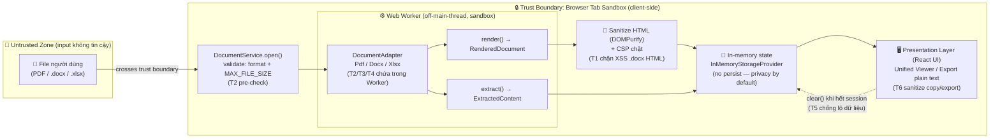
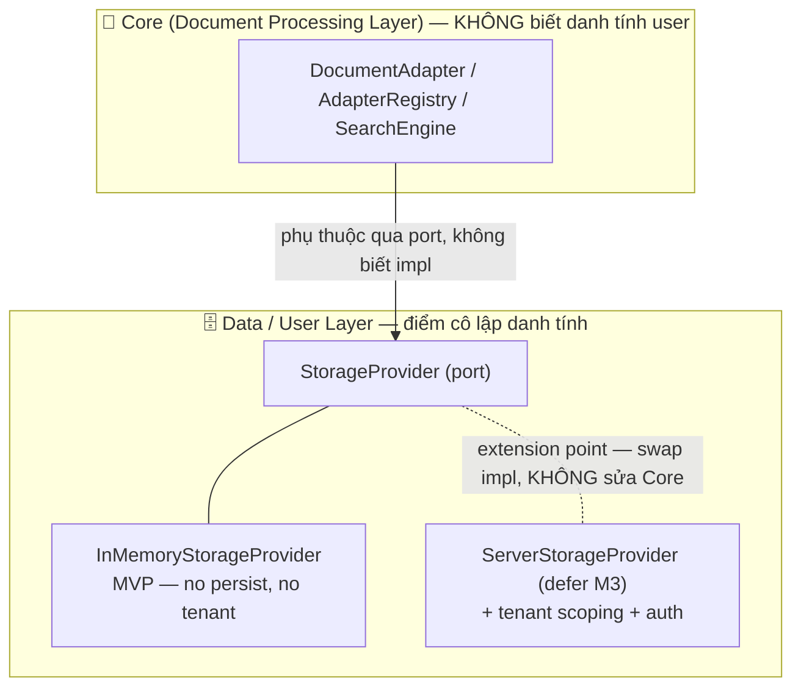

# 🔐 Spec-Security / Threat Model — DocsViewer (Client-Side MVP)

## Mục lục

1. [Mục đích & Phạm vi](#1-mục-đích--phạm-vi)
2. [Security Posture (Thế trận bảo mật)](#2-security-posture-thế-trận-bảo-mật)
3. [Trust Boundary & Data Flow (STRIDE-style)](#3-trust-boundary--data-flow-stride-style)
4. [Threat Model](#4-threat-model)
5. [Data-Layer Separation & Extension Point (M3)](#5-data-layer-separation--extension-point-m3)
6. [Deferral rõ ràng — Multi-tenant Threat Model](#6-deferral-rõ-ràng--multi-tenant-threat-model)
7. [Security Auditor Review](#7-security-auditor-review)
8. [Tài liệu tham khảo](#8-tài-liệu-tham-khảo)

---

## 1. Mục đích & Phạm vi

Tài liệu này định nghĩa **Security Posture** và **Threat Model** cho DocsViewer ở milestone **M1 (MVP)** — phạm vi **client-side, single-user**. Đây là artifact phục vụ **mandatory security gate** trước Phase 3 (implementation): Security Auditor PHẢI review & ký sign-off (xem [§7](#7-security-auditor-review)).

**Scope (trong phạm vi):**

- Tài liệu được người dùng đưa vào trình duyệt (Untrusted input) → parse/render/extract **hoàn toàn trong browser**.
- 3 định dạng lõi: PDF, `.docx`, `.xlsx` (xem [Glossary — Core Formats](../../999-Resources/Glossary.md)).
- Các bề mặt tấn công phát sinh từ việc xử lý file không tin cậy bằng OSS lib trên main thread/Web Worker.

**Out of scope (defer):**

- Auth, session người dùng, multi-tenant data isolation, persistence — tách lớp sẵn từ MVP nhưng **không** kích hoạt ở M1 (defer M3 — xem [§6](#6-deferral-rõ-ràng--multi-tenant-threat-model)).

> [!IMPORTANT]
> Việc tách lớp dữ liệu người dùng (parse/extract không phụ thuộc danh tính) là một yêu cầu chất lượng đã được chốt tại [NFR-05](../../020-Requirements/NFR-DocsViewer.md) (trace [R-03](../../010-Planning/Risk-Register.md), KR3.1/KR3.3). Spec này hiện thực hóa NFR-05 ở khía cạnh security mà **không** restate các con số/score (SSOT nằm ở file requirement gốc).

---

## 2. Security Posture (Thế trận bảo mật)

Thế trận bảo mật của MVP dựa trên một quyết định kiến trúc cốt lõi: **100% xử lý trong browser, không có backend, không upload mạng, không persistence** (xem [ADR-002 — Client-Side Processing](../Architecture/ADR-002-Client-Side-Processing.md)). Hệ quả trực tiếp là **attack surface tối thiểu**.

| Trụ cột | Cam kết MVP | Hệ quả bảo mật |
| :------ | :---------- | :------------- |
| **Single-user, client-side** | Không có server-side execution, không API endpoint, không DB (xem [Glossary — Single-user](../../999-Resources/Glossary.md)). | Loại bỏ toàn bộ lớp threat server-side (SQLi, broken auth, SSRF, server RCE). |
| **No network upload** | File **không** rời thiết bị người dùng; mọi byte ở lại trong tiến trình tab trình duyệt. | Không có dữ liệu trên đường truyền cần bảo vệ; không có data-at-rest phía server. |
| **No persistence** | Trạng thái session chỉ tồn tại in-memory; không ghi `localStorage`/IndexedDB/cookie chứa nội dung tài liệu. | Privacy by default — tài liệu nhạy cảm bị xóa khi kết thúc session/đóng tab. |
| **Privacy by default** | Mọi state gắn nội dung tài liệu được dọn (`StorageProvider.clear`) khi hết session. | Giảm thiểu lộ dữ liệu nhạy cảm (mục tiêu phòng ngừa của [R-03](../../010-Planning/Risk-Register.md)). |

**Kết luận posture:** Bề mặt tấn công thực tế của MVP **không** nằm ở mạng hay hạ tầng, mà tập trung ở **xử lý nội dung file không tin cậy phía client** (parsing/rendering). Đó là lý do Threat Model ở [§4](#4-threat-model) tập trung vào các threat content-borne (XSS, zip-bomb, malicious PDF, prototype pollution, injection) thay vì các threat hạ tầng.

---

## 3. Trust Boundary & Data Flow (STRIDE-style)

Sơ đồ dưới mô tả **trust boundary** giữa file không tin cậy (Untrusted) và môi trường thực thi của ứng dụng (browser sandbox). Mọi byte đi qua boundary đều được coi là **adversarial input** và phải qua validate + sanitize trước khi tới UI.

**Đọc sơ đồ theo STRIDE (rút gọn cho client-side):**

- **Tampering / Elevation:** input không tin cậy bị cô lập trong Web Worker; render output đi qua sanitize trước khi chạm DOM ([T1](#4-threat-model)).
- **Denial of Service:** pre-check `MAX_FILE_SIZE` trước boundary + parse trong Worker để main thread không bị khóa ([T2](#4-threat-model)).
- **Information Disclosure:** không có path nào dẫn ra ngoài boundary (không network, không persist) → dữ liệu chỉ sống trong tab ([T5](#4-threat-model)).

> Các tên gọi (`DocumentService.open`, `DocumentAdapter`, `InMemoryStorageProvider`, `RenderedDocument`, `ExtractedContent`) là canonical theo Module Contracts; xem [Spec-Module-Contracts](../API/Spec-Module-Contracts.md).

---

## 4. Threat Model

Phạm vi: **client-side MVP**. Bảng dưới liệt kê các threat content-borne trọng yếu cần Security Auditor review (gate bắt buộc).

| ID | Threat | Mức | Mitigation |
| :-- | :-- | :-- | :-- |
| T1 | **XSS qua `.docx` render HTML** (docx-preview render HTML từ doc không tin cậy) | HIGH | Sanitize HTML (DOMPurify), render trong container sandbox, CSP chặt. |
| T2 | **Decompression/zip-bomb** (`.docx`/`.xlsx` là zip) → DoS bộ nhớ | MED | MAX_FILE_SIZE pre-check; parse trong Worker; cân nhắc cap kích thước giải nén. |
| T3 | **Malicious PDF / PDF.js exploit** | MED | Pin & update PDF.js; chạy trong PDF.js worker; **tắt cả `isEvalSupported: false` và `enableScripting: false`** (PDF.js thực thi JS nhúng trong tài liệu). Worker = cô lập *thread* (giảm DoS), **không phải** security/origin boundary — RCE trong worker vẫn same-origin, nên hàng phòng ngừa rò rỉ thực sự là CSP `connect-src` (xem T7). |
| T4 | **Prototype pollution** trong parser libs | LOW-MED | Pin & update libs (SCA); tránh unsafe deep-merge; freeze/null-proto cho object nhận từ parser khi merge config. |
| T5 | **Lộ dữ liệu nhạy cảm** (tài liệu user nhạy cảm — R-03) | — (design) | **Privacy by default:** MVP client-side, KHÔNG upload server, KHÔNG persist ngoài session; data-layer separation; clear khi hết session. |
| T6 | **Injection khi copy/export** | LOW | Export plain text; sanitize nội dung khi copy. Với `.xlsx`: chống **CSV/formula injection** — prefix `'` cho cell bắt đầu bằng `= + - @` khi export. |
| T7 | **Supply-chain / compromised dependency** (PDF.js / docx-preview / mammoth / SheetJS / DOMPurify bị nhiễm) → exfiltrate tài liệu hoặc inject XSS ngay trong browser user | MED-HIGH | Lockfile pinning (exact version) + integrity hash; SCA tự động (Dependabot/`npm audit`) trong CI; **CSP `connect-src 'self'` + `default-src 'self'`** chặn mọi đường exfil ra domain lạ (đây cũng là backstop cho T1/T2/T3); SRI nếu nạp asset qua CDN; review changelog trước khi bump version. |

**Ghi chú gắn requirement & use case:**

- **T1** là threat có mức cao nhất vì docx-preview dựng HTML trực tiếp từ tài liệu không tin cậy; mitigation phải áp dụng **trước** khi HTML chạm DOM của Unified Viewer.
- **T2** dùng chính `MAX_FILE_SIZE` (PDF ≤ 25 MB · `.docx` ≤ 25 MB · `.xlsx` ≤ 15 MB) làm hàng rào phòng thủ đầu tiên (pre-check tại `DocumentService.open`, tương ứng [UC-02](../../020-Requirements/Use-Cases/UC-02-Upload-View-Document.md) E2). Ngưỡng này tunable theo perf thực đo ([NFR-07](../../020-Requirements/NFR-DocsViewer.md), [R-05](../../010-Planning/Risk-Register.md)).
- **T3/T4** chạy trong Web Worker — đây là **thread isolation** (giữ main thread responsive, giảm DoS từ T2), **KHÔNG phải security/origin boundary**: một RCE trong worker vẫn chạy same-origin và có thể `fetch()` exfiltrate. Vì vậy mitigation thực sự của T3 là tắt scripting/eval của PDF.js + pin/update + SCA, và backstop chung là CSP `connect-src` (T7) — không dựa vào worker như rào chắn bảo mật.
- **T7** là threat đặc thù & hiện thực nhất của kiến trúc 100% client-side: vì toàn bộ nội dung tài liệu nằm trong tab, một dependency parser bị compromise có thể đọc và gửi dữ liệu đi. Phòng thủ theo chiều sâu: pin version + SCA trong CI (catch trước khi ship) **kết hợp** CSP `connect-src 'self'` (chặn exfil runtime). CSP phải được **deliver thật** (meta tag trong `index.html` hoặc HTTP header của static host), không chỉ ghi trên giấy.
- **T5** không phải lỗ hổng kỹ thuật mà là yêu cầu thiết kế (severity `— (design)`): đáp ứng bằng posture "no upload / no persist" ([§2](#2-security-posture-thế-trận-bảo-mật)) + data-layer separation ([§5](#5-data-layer-separation--extension-point-m3)). Đây là cách MVP phòng ngừa chủ động cho [R-03](../../010-Planning/Risk-Register.md).
- **T6** áp dụng khi `copyExtracted`/`exportExtracted` ([UC-03](../../020-Requirements/Use-Cases/UC-03-Extract-Export-Content.md)): export ở dạng plain text, sanitize nội dung trước khi ghi clipboard để tránh formula/command injection ở ứng dụng đích.

---

## 5. Data-Layer Separation & Extension Point (M3)

Trụ cột bảo mật dài hạn của DocsViewer là **tách lớp dữ liệu người dùng ngay từ MVP** để không phải viết lại core khi mở multi-user. Quyết định kiến trúc này được định nghĩa tại [ADR-004 — Data-Layer Separation](../Architecture/ADR-004-Data-Layer-Separation.md) và hiện thực hóa yêu cầu [NFR-05](../../020-Requirements/NFR-DocsViewer.md) (trace KR3.1/KR3.3).

**Nguyên tắc bảo mật của việc tách lớp:**

- **Core thuần (parse/extract/search) không phụ thuộc danh tính người dùng** → logic xử lý tài liệu không thể vô tình rò rỉ dữ liệu giữa các tenant, vì nó không hề biết khái niệm tenant (KR3.1).
- **`StorageProvider` là port** — toàn bộ trạng thái gắn người dùng/tenant bị cô lập sau interface này. MVP dùng `InMemoryStorageProvider` (không persist, không tenant). Khi lên M3, chỉ **thay impl** thành một provider có tenant scoping + auth, **không sửa Core** (KR3.3).
- Đây là **extension point** cho mọi hardening multi-tenant ở M3 (data isolation, access control), được đặt sẵn đúng vị trí trên dependency rule một chiều (Presentation → Application → Core → Data).

> Tên canonical `StorageProvider` / `InMemoryStorageProvider` / `ServerStorageProvider` theo Module Contracts — xem [Spec-Module-Contracts](../API/Spec-Module-Contracts.md).

---

## 6. Deferral rõ ràng — Multi-tenant Threat Model

> [!WARNING]
> **Threat model multi-tenant đầy đủ: Out of scope MVP — defer M3.**

Rủi ro bảo mật/privacy thực sự (theo [R-03](../../010-Planning/Risk-Register.md)) phát sinh khi hệ thống lên **multi-user/multi-tenant** ở M3. Theo [NFR-05](../../020-Requirements/NFR-DocsViewer.md), MVP chỉ cam kết **phòng ngừa bằng kiến trúc** (data-layer separation + extension point — [§5](#5-data-layer-separation--extension-point-m3)); một **threat model riêng cho multi-tenant** (auth, session, data isolation, access control, threat trên đường truyền & at-rest khi có server) sẽ được lập **trước khi mở multi-tenant** ở M3.

Các hạng mục **defer M3** (không phân tích threat ở M1):

- Authentication & session management.
- Tenant data isolation & access control.
- Server-side storage threats (data-at-rest, data-in-transit).
- Audit logging / observability cho hành vi multi-user.

---

## 7. Security Auditor Review

> Phần này là **mandatory gate** của Phase 2 (trước Phase 3 — implementation). Security Auditor đối soát toàn bộ Threat Model ([§4](#4-threat-model)), Posture ([§2](#2-security-posture-thế-trận-bảo-mật)) và Trust Boundary ([§3](#3-trust-boundary--data-flow-stride-style)) trước khi ký sign-off.

### 7.1. Verdict

**APPROVED-WITH-CONDITIONS** — Threat Model đủ tốt cho phạm vi **client-side MVP (M1)**; gate Phase-2 **PASS**, được phép vào Phase 3 với điều kiện các mục [§7.3](#73-điều-kiện-bắt-buộc-cho-phase-3-implementation) được hiện thực hóa đúng trong code.

### 7.2. Đánh giá của Security Auditor

**Điểm mạnh (xác nhận):**

- Posture "no backend / no network upload / no persist" ([§2](#2-security-posture-thế-trận-bảo-mật)) loại bỏ chính xác lớp threat server-side — đây là quyết định kiến trúc đúng, không phải né tránh.
- 6 threat content-borne gốc (T1–T6) được capture đầy đủ, mức severity hợp lý; T1 (XSS qua `.docx` HTML) được nhận diện đúng là cao nhất với mitigation áp **trước** khi chạm DOM.
- Multi-tenant (auth/session/data isolation/at-rest/in-transit) được **defer M3 đúng cách** theo [NFR-05](../../020-Requirements/NFR-DocsViewer.md) ([§6](#6-deferral-rõ-ràng--multi-tenant-threat-model)); việc gài sẵn `StorageProvider` port ([§5](#5-data-layer-separation--extension-point-m3), [ADR-004](../Architecture/ADR-004-Data-Layer-Separation.md)) là privacy-by-design hợp lý mà **không** over-scope MVP. Auditor xác nhận **không bổ sung** threat server-side vào M1.

**Gap đã được sửa trong review này (đưa vào bảng [§4](#4-threat-model)):**

- **T7 — Supply-chain / compromised dependency (MED-HIGH, đã thêm):** Với app 100% client-side, một parser dependency bị nhiễm (PDF.js/docx-preview/mammoth/SheetJS/DOMPurify) là vector hiện thực nhất để exfiltrate tài liệu hoặc inject XSS. Bản draft chỉ chạm tới ở T4 (prototype pollution) — chưa đủ. Đã thêm T7 với mitigation theo chiều sâu (lockfile pinning + SCA trong CI + CSP `connect-src 'self'`).
- **Làm rõ ranh giới Web Worker (T3/T4):** Worker là **thread isolation**, KHÔNG phải security/origin boundary; đã chỉnh lại để không overclaim "containment" và trỏ phòng thủ thật về tắt scripting/eval + CSP.
- **PDF.js (T3):** nâng từ "tắt eval" thành tắt **cả** `isEvalSupported: false` **và** `enableScripting: false` (PDF.js thực thi JS nhúng).
- **Export injection (T6):** bổ sung phòng CSV/formula injection cho `.xlsx` export.

### 7.3. Điều kiện bắt buộc cho Phase 3 (implementation)

Các điều kiện sau **không** chặn việc duyệt Threat Model nhưng **PHẢI** được verify trong code review/QA trước release:

1. **CSP deliver thật** — `default-src 'self'`, `connect-src 'self'`, không `unsafe-eval`; đặt qua meta tag trong `index.html` hoặc HTTP header của static host (không chỉ ghi trên spec). Đây là backstop chung cho T1/T3/T7.
2. **DOMPurify áp đúng vị trí (T1)** — sanitize HTML của `.docx` **trước** khi gắn vào DOM của Unified Viewer; cấu hình mặc định an toàn (không cho phép `<script>`/event handler/`javascript:` URI).
3. **PDF.js hardening (T3)** — khởi tạo với `isEvalSupported: false` và `enableScripting: false`.
4. **Dependency integrity (T7)** — lockfile pin exact version, bật SCA tự động (Dependabot/`npm audit`) trong CI; SRI nếu có CDN asset.
5. **Export sanitize (T6)** — export plain text; với `.xlsx` chống formula injection (prefix `'` cho cell bắt đầu bằng `= + - @`).

### 7.4. Sign-off

_Reviewed & signed off by Security Auditor — 2026-06-24._

---

## 8. Tài liệu tham khảo

- [NFR — DocsViewer](../../020-Requirements/NFR-DocsViewer.md) (NFR-05)
- [Risk Register — DocsViewer](../../010-Planning/Risk-Register.md) (R-03)
- [PRD — DocsViewer](../../020-Requirements/PRD-DocsViewer.md)
- [UC-02 — Upload & View Document](../../020-Requirements/Use-Cases/UC-02-Upload-View-Document.md)
- [UC-03 — Extract & Export Content](../../020-Requirements/Use-Cases/UC-03-Extract-Export-Content.md)
- [Glossary — DocsViewer](../../999-Resources/Glossary.md)
- [ADR-002 — Client-Side Processing](../Architecture/ADR-002-Client-Side-Processing.md)
- [ADR-004 — Data-Layer Separation](../Architecture/ADR-004-Data-Layer-Separation.md)
- [Spec-Module-Contracts](../API/Spec-Module-Contracts.md)

---
*Generated by TNMCORE-OS Architect Role · Reviewed by Security Auditor.*
