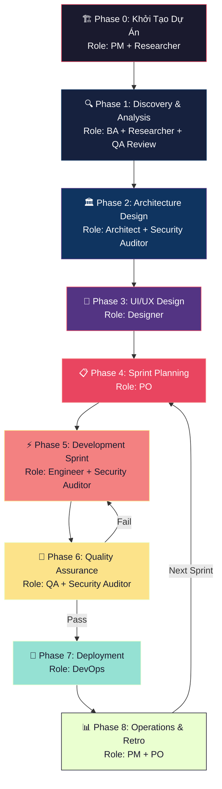
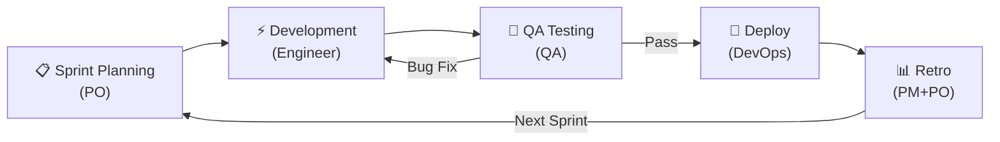

# 🚀 Quy Trình Phát Triển Dự Án End-to-End (SDLC + Agile/Scrum) với TNMCORE-OS

> **Version 3.0** — Index file tổng quan quy trình SDLC. Chi tiết từng Phase được tách riêng tại `SDLC-Phases/` để tối ưu Context Loading.

## Mục lục

1. [Tổng Quan Quy Trình](#1-tổng-quan-quy-trình)
2. [Sơ Đồ Tổng Thể (Big Picture)](#2-sơ-đồ-tổng-thể-big-picture)
3. [Vai Trò Xuyên Suốt (Cross-cutting Roles)](#3-vai-trò-xuyên-suốt-cross-cutting-roles)
4. [Danh Mục Phase (Just-in-Time Loading)](#4-danh-mục-phase-just-in-time-loading)
5. [Bảng Tổng Hợp Nhanh (Cheatsheet)](#5-bảng-tổng-hợp-nhanh-cheatsheet)
6. [Quy Trình Lặp Lại (Sprint Cycle)](#6-quy-trình-lặp-lại-sprint-cycle)
7. [Tài Liệu Tham Khảo](#7-tài-liệu-tham-khảo)

---

## 1. Tổng Quan Quy Trình

Quy trình này kết hợp **SDLC truyền thống** (đảm bảo đủ phase) với **Agile/Scrum** (lặp lại linh hoạt theo Sprint) và **TNMCORE-OS** (tận dụng sức mạnh AI Agent với các Role chuyên biệt).

### Nguyên tắc cốt lõi:

- **Spec-Driven:** Đặc tả trước, code sau. Không Role nào được bỏ qua bước tạo artifact.
- **Human-in-the-Loop:** User luôn approve trước mỗi phase chuyển tiếp.
- **Traceability:** Mọi artifact đều liên kết với nhau qua standard markdown links và frontmatter.
- **Iterative:** Sau Phase 3, quy trình lặp lại theo Sprint (Phase 4 → 5 → 6 → 7 → 8 → quay lại 4).
- **Security-by-Design:** Bảo mật được tích hợp xuyên suốt, không phải bước cuối cùng.
- **Shift-Left Quality:** QA review Specs ngay từ giai đoạn sớm (Phase 1-2), không chỉ test ở Phase 6.

### Quy mô dự án (Scale Indicator):

| Quy mô | Phase 0 | Phase 1 | Phase 2-3 | Sprint Cycle |
| :------ | :------ | :------ | :-------- | :----------- |
| 🟢 **Small/MVP** | Charter nhẹ (1 trang), bỏ OKRs/Risk Register | PRD gọn, tập trung MVP Stories | Có thể gộp hoặc đơn giản hóa | 1 tuần/Sprint |
| 🟡 **Medium** | Đầy đủ nhưng gọn | Đầy đủ | Tuần tự hoặc song song | 2 tuần/Sprint |
| 🔴 **Large/Enterprise** | Đầy đủ + Researcher chuyên sâu | Đầy đủ + BRD chi tiết | Tuần tự, có Security Gate | 2-4 tuần/Sprint |

### Quan hệ với Universal Workflow:

> [!NOTE]
> Tài liệu này mô tả quy trình **cấp dự án** (Project-level SDLC). Trong mỗi Sprint, từng Story/Task được thực hiện theo **[Universal Workflow 6 bước](./Universal-Workflow.md)**: `Discovery → Solution → Plan → Implementation → Verification → Retro`.

---

## 2. Sơ Đồ Tổng Thể (Big Picture)

> [!IMPORTANT]
> **Phase 0 → 3** thực hiện **một lần** khi bắt đầu dự án (hoặc khi có thay đổi lớn).  
> **Phase 4 → 8** là **vòng lặp Sprint** (thường 1-2 tuần), lặp lại liên tục cho tới khi dự án hoàn thành.

> [!TIP]
> **Phase 2 ↔ Phase 3 có thể linh hoạt thứ tự** tùy bản chất dự án:
> - **Product-led** (B2C App, Landing page): Chạy Phase 3 (UI/UX) trước hoặc song song Phase 2 để validate ý tưởng sớm.
> - **Tech-led** (API Platform, Backend Service): Chạy Phase 2 (Architecture) trước để xác định giới hạn kỹ thuật.

---

## 3. Vai Trò Xuyên Suốt (Cross-cutting Roles)

Ngoài Role chính của từng Phase, có **3 vai trò đặc biệt** tham gia xuyên suốt quy trình:

| Role                    | File                               | Tham gia tại                                            | Chức năng                                                                    |
| :---------------------- | :--------------------------------- | :------------------------------------------------------ | :--------------------------------------------------------------------------- |
| 🕵️ **Researcher**       | `.agent/roles/researcher.md`       | **Phase 0-1** (support)                                 | Nghiên cứu thị trường, đối thủ, tech trends. Output tại `docs/050-Research/` |
| 🛡️ **Security Auditor** | `.agent/roles/security-auditor.md` | **Phase 2** (Threat Model) + **Phase 5-6** (Code Audit) | Review Gate bảo mật xuyên suốt. Output tại `docs/030-Specs/Security/`        |
| 🔍 **Context Auditor**  | `.agent/roles/context-auditor.md`  | **Periodic** (mỗi 2-3 Sprint)                           | Kiểm toán SSOT, Knowledge Hygiene, đảm bảo tính nhất quán tài liệu           |

> [!NOTE]
> **Senior AI Engineer** (`.agent/roles/senior-ai-engineer.md`) được kích hoạt khi dự án có tính năng AI/LLM, không nằm trong quy trình SDLC tiêu chuẩn.

---

## 4. Danh Mục Phase (Just-in-Time Loading)

> [!TIP]
> **Context Engineering:** Agent chỉ cần đọc file Index này khi `/wake-up`. Khi làm việc ở Phase cụ thể, hãy nạp file chi tiết tương ứng bên dưới.

| Phase | Tên | Role chính | File chi tiết |
| :---- | :-- | :--------- | :------------ |
| **0** | 🏗️ Khởi Tạo Dự Án | 🎩 PM | [Phase-0-Project-Inception](./SDLC-Phases/Phase-0-Project-Inception.md) |
| **1** | 🔍 Discovery & Analysis | 🕵️ BA | [Phase-1-Discovery-Analysis](./SDLC-Phases/Phase-1-Discovery-Analysis.md) |
| **2** | 🏛️ Architecture Design | 🏗️ Architect | [Phase-2-Architecture-Design](./SDLC-Phases/Phase-2-Architecture-Design.md) |
| **3** | 🎨 UI/UX Design | 🎨 Designer | [Phase-3-Product-Design](./SDLC-Phases/Phase-3-Product-Design.md) |
| **4** | 📋 Sprint Planning | 📋 PO | [Phase-4-Sprint-Planning](./SDLC-Phases/Phase-4-Sprint-Planning.md) |
| **5** | ⚡ Development Sprint | 🧑‍💻 Engineer | [Phase-5-Development-Sprint](./SDLC-Phases/Phase-5-Development-Sprint.md) |
| **6** | 🧪 Quality Assurance | 🧪 QA | [Phase-6-Quality-Assurance](./SDLC-Phases/Phase-6-Quality-Assurance.md) |
| **7** | 🚀 Deployment & Release | 🛡️ DevOps | [Phase-7-Deployment-Release](./SDLC-Phases/Phase-7-Deployment-Release.md) |
| **8** | 📊 Operations & Retro | 🎩 PM + 📋 PO | [Phase-8-Operations-Retro](./SDLC-Phases/Phase-8-Operations-Retro.md) |

---

## 5. Bảng Tổng Hợp Nhanh (Cheatsheet)

| Phase | Role chính    | Support Roles            | Lệnh kích hoạt         | Skills gợi ý                                    | Output chính                 | Thư mục SSOT                              |
| :---- | :------------ | :----------------------- | :--------------------- | :---------------------------------------------- | :--------------------------- | :---------------------------------------- |
| **0** | 🎩 PM         | Researcher               | `"Đóng vai PM"`        | `product-manager-toolkit`, `product-strategist` | Charter, Roadmap, OKRs, MVP Scope | `010-Planning/`                           |
| **1** | 🕵️ BA         | PM, Researcher, QA       | `"Đóng vai BA"`        | `business-analyst`, `brainstorming`             | PRD, SRS, Stories, Prioritized Backlog | `020-Requirements/` + `022-User-Stories/` |
| **2** | 🏗️ Architect  | Security Auditor, DevOps | `"Đóng vai Architect"` | `software-architecture`, `senior-architect`     | SDD, ADR, API Specs, Schema  | `030-Specs/`                              |
| **3** | 🎨 Designer   | —                        | `"Đóng vai Designer"`  | `ui-ux-pro-max`, `ui-design-system`             | Design System, Wireframes    | `040-Design/`                             |
| **4** | 📋 PO         | —                        | `"Đóng vai PO"`        | `agile-product-owner`, `clickup-expert`         | Sprint Plan, Active Stories  | `010-Planning/Sprints/`                   |
| **5** | 🧑‍💻 Engineer   | Security Auditor         | `"Đóng vai Engineer"`  | `software-engineer`, `typescript-expert`        | Source Code, PRs             | `src/` + OpenSpec                         |
| **6** | 🧪 QA         | Security Auditor         | `"Đóng vai QA"`        | `quality-assurance`, `senior-qa`                | Test Plan/Cases/Report       | `035-QA/`                                 |
| **7** | 🛡️ DevOps     | —                        | `"Đóng vai DevOps"`    | `senior-devops`, `git-pushing`                  | Release Notes, Runbook       | `070-Deployment/`                         |
| **8** | 🎩 PM + 📋 PO | —                        | PM + PO                | `scrum-master`                                  | Retro, Updated Backlog       | `080-Operations/` + Memory                |

---

## 6. Quy Trình Lặp Lại (Sprint Cycle)

Sau khi hoàn thành Phase 0-3 (nền tảng), quy trình sẽ chuyển sang **Sprint Cycle** lặp lại.

> [!NOTE]
> **Quan hệ SDLC ↔ Universal Workflow:** Trong mỗi Sprint, từng Story/Task được thực hiện theo [Universal Workflow 6 bước](./Universal-Workflow.md): `Discovery → Solution → Plan → Implementation → Verification → Retro`. SDLC Workflow quản lý ở **cấp dự án**, Universal Workflow quản lý ở **cấp task**.

### Hoạt động trong Sprint:

| Hoạt động     | Tần suất                 | Workflow / Tool hỗ trợ                            |
| :------------ | :----------------------- | :------------------------------------------------ |
| Daily Standup | Hằng ngày                | `/daily-report`, `/scrum-daily-report`            |
| Code Review   | Mỗi PR                   | Skill `code-reviewer`, `requesting-code-review`   |
| Security Scan | Mỗi Sprint (hoặc per-PR) | Skill `vulnerability-scanner`, `security-auditor` |
| Sprint Review | Cuối Sprint              | `/scrum-sprint-report`                            |
| Retrospective | Cuối Sprint              | `/memo`                                           |
| Context Audit | Mỗi 2-3 Sprint           | Role `Context Auditor` — kiểm toán SSOT           |

---

## 7. Tài Liệu Tham Khảo

1. [AGENTS.md — Primary Context](../../AGENTS.md)
2. [OS-Handbook — Cẩm nang vận hành](../../OS-Handbook.md)
3. [Documents-Template — Quy tắc cấu trúc tài liệu](../../knowledge-base/99-Templates/Documents-Template.md)
4. [Project Governance — Quản trị dự án](../../knowledge-base/20-Project/Project-Governance.md)
5. [Coding Standards — Tiêu chuẩn code](../../knowledge-base/10-Technical/Coding-Standards.md)
6. [Scrum Guide 2020](https://scrumguides.org/scrum-guide.html)
7. [PMBOK Guide 7th Edition](https://www.pmi.org/pmbok-guide-standards/foundational/pmbok)

---

_Tài liệu v3.0 — Tách Phase riêng biệt để tối ưu Context Engineering (Just-in-Time Loading). Tạo bởi TNMCORE-OS._
